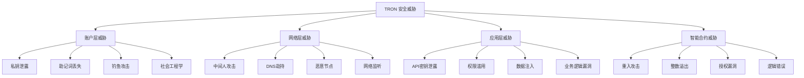
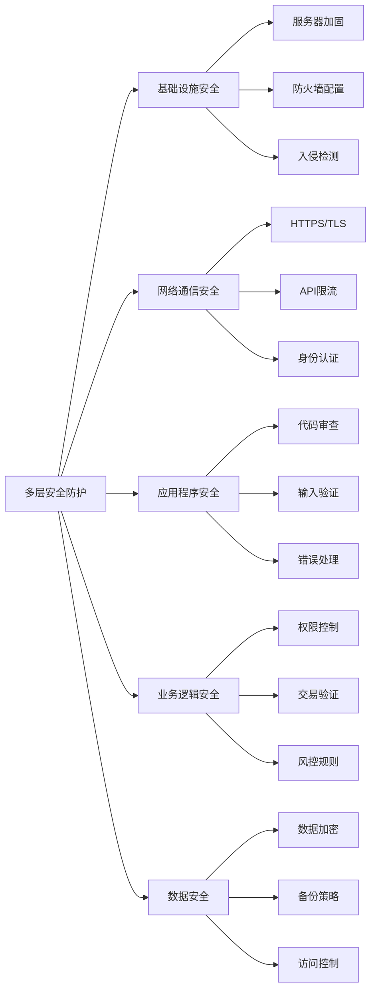

# 🔐 TRON API 安全和最佳实践文档

> TRON 开发安全策略、最佳实践和风险防范的完整指南

## 📋 目录

- [安全概述](#安全概述)
- [私钥和账户安全](#私钥和账户安全)
- [智能合约安全](#智能合约安全)
- [API 安全实践](#api-安全实践)
- [交易安全处理](#交易安全处理)
- [监控和审计](#监控和审计)
- [应急响应](#应急响应)

## 🎯 安全概述

### TRON 安全威胁模型



### 安全防护层级



## 🔑 私钥和账户安全

### 私钥管理最佳实践

```typescript
/**
 * 安全的私钥管理服务
 */
export class SecureKeyManager {
  /**
   * 生成安全的随机私钥
   */
  static generateSecurePrivateKey(): {
    privateKey: string;
    publicKey: string;
    address: string;
    entropy: string;
  } {
    try {
      console.log(`🔐 Generating secure private key`);

      // 使用强随机数生成器
      const entropy = tronWeb.utils.crypto.generateRandom();
      const account = tronWeb.utils.accounts.generateAccount();
      
      console.log(`✅ Secure private key generated`);
      
      return {
        privateKey: account.privateKey,
        publicKey: account.publicKey,
        address: account.address.base58,
        entropy: entropy.toString('hex')
      };

    } catch (error) {
      console.error(`❌ Failed to generate secure private key:`, error);
      throw error;
    }
  }

  /**
   * 加密存储私钥
   */
  static encryptPrivateKey(
    privateKey: string,
    password: string,
    options: {
      algorithm?: string;
      iterations?: number;
      keyLength?: number;
    } = {}
  ): {
    success: boolean;
    encryptedKey?: string;
    salt?: string;
    error?: string;
  } {
    try {
      console.log(`🔒 Encrypting private key`);

      const {
        algorithm = 'aes-256-gcm',
        iterations = 100000,
        keyLength = 32
      } = options;

      const crypto = require('crypto');
      
      // 生成随机盐
      const salt = crypto.randomBytes(16);
      
      // 使用PBKDF2生成密钥
      const key = crypto.pbkdf2Sync(password, salt, iterations, keyLength, 'sha256');
      
      // 加密私钥
      const cipher = crypto.createCipher(algorithm, key);
      let encryptedKey = cipher.update(privateKey, 'utf8', 'hex');
      encryptedKey += cipher.final('hex');
      
      console.log(`✅ Private key encrypted successfully`);

      return {
        success: true,
        encryptedKey,
        salt: salt.toString('hex')
      };

    } catch (error) {
      console.error(`❌ Failed to encrypt private key:`, error);
      return {
        success: false,
        error: error.message
      };
    }
  }

  /**
   * 解密私钥
   */
  static decryptPrivateKey(
    encryptedKey: string,
    password: string,
    salt: string,
    options: {
      algorithm?: string;
      iterations?: number;
      keyLength?: number;
    } = {}
  ): {
    success: boolean;
    privateKey?: string;
    error?: string;
  } {
    try {
      console.log(`🔓 Decrypting private key`);

      const {
        algorithm = 'aes-256-gcm',
        iterations = 100000,
        keyLength = 32
      } = options;

      const crypto = require('crypto');
      
      // 重建密钥
      const saltBuffer = Buffer.from(salt, 'hex');
      const key = crypto.pbkdf2Sync(password, saltBuffer, iterations, keyLength, 'sha256');
      
      // 解密私钥
      const decipher = crypto.createDecipher(algorithm, key);
      let privateKey = decipher.update(encryptedKey, 'hex', 'utf8');
      privateKey += decipher.final('utf8');
      
      // 验证私钥格式
      if (!tronWeb.utils.isHex(privateKey) || privateKey.length !== 64) {
        throw new Error('Invalid decrypted private key format');
      }

      console.log(`✅ Private key decrypted successfully`);

      return {
        success: true,
        privateKey
      };

    } catch (error) {
      console.error(`❌ Failed to decrypt private key:`, error);
      return {
        success: false,
        error: error.message
      };
    }
  }

  /**
   * 安全的私钥验证
   */
  static validatePrivateKey(privateKey: string): {
    valid: boolean;
    address?: string;
    publicKey?: string;
    issues?: string[];
  } {
    try {
      console.log(`✅ Validating private key`);

      const issues: string[] = [];

      // 基础格式检查
      if (!privateKey || typeof privateKey !== 'string') {
        issues.push('私钥必须是有效的字符串');
      }

      if (!tronWeb.utils.isHex(privateKey)) {
        issues.push('私钥必须是有效的十六进制字符串');
      }

      if (privateKey.length !== 64) {
        issues.push('私钥长度必须是64个字符（32字节）');
      }

      // 安全性检查
      const keyBigInt = BigInt('0x' + privateKey);
      const maxKey = BigInt('0xFFFFFFFFFFFFFFFFFFFFFFFFFFFFFFFEBAAEDCE6AF48A03BBFD25E8CD0364141');
      
      if (keyBigInt <= 0n) {
        issues.push('私钥不能为0');
      }

      if (keyBigInt >= maxKey) {
        issues.push('私钥超出了有效范围');
      }

      // 常见弱私钥检查
      const weakKeys = [
        '0000000000000000000000000000000000000000000000000000000000000001',
        'FFFFFFFFFFFFFFFFFFFFFFFFFFFFFFFFFFFFFFFFFFFFFFFFFFFFFFFFFFFFFFFF'
      ];

      if (weakKeys.includes(privateKey.toUpperCase())) {
        issues.push('检测到弱私钥，存在安全风险');
      }

      if (issues.length > 0) {
        return {
          valid: false,
          issues
        };
      }

      // 生成地址验证
      const account = tronWeb.utils.accounts.generateAccount();
      const derivedAccount = tronWeb.utils.accounts.generateAccountWithPrivateKey(privateKey);

      return {
        valid: true,
        address: derivedAccount.address.base58,
        publicKey: derivedAccount.publicKey
      };

    } catch (error) {
      console.error(`❌ Private key validation failed:`, error);
      return {
        valid: false,
        issues: ['私钥验证过程中发生错误']
      };
    }
  }

  /**
   * 多签账户创建
   */
  static async createMultiSigAccount(
    ownerKeys: string[],
    threshold: number,
    activeKeys?: string[],
    activeThreshold?: number
  ): Promise<{
    success: boolean;
    multisigAddress?: string;
    ownerKeyIds?: number[];
    activeKeyIds?: number[];
    error?: string;
  }> {
    try {
      console.log(`👥 Creating multi-signature account`);

      if (ownerKeys.length < threshold) {
        throw new Error('Owner keys count must be >= threshold');
      }

      if (threshold < 1) {
        throw new Error('Threshold must be >= 1');
      }

      // 构建权限结构
      const ownerPermission = {
        type: 0, // owner permission
        permission_name: 'owner',
        threshold,
        keys: ownerKeys.map((key, index) => ({
          address: tronWeb.utils.accounts.generateAccountWithPrivateKey(key).address.base58,
          weight: 1
        }))
      };

      const activePermission = activeKeys ? {
        type: 2, // active permission
        permission_name: 'active',
        threshold: activeThreshold || threshold,
        operations: '7fff1fc0037e0000000000000000000000000000000000000000000000000000', // 所有操作
        keys: activeKeys.map((key, index) => ({
          address: tronWeb.utils.accounts.generateAccountWithPrivateKey(key).address.base58,
          weight: 1
        }))
      } : null;

      // 创建多签账户需要通过AccountPermissionUpdateContract
      // 这里提供结构示例，实际实现需要更多步骤

      console.log(`✅ Multi-signature account structure created`);

      return {
        success: true,
        multisigAddress: 'TMultiSigAddress...', // 实际地址需要部署计算
        ownerKeyIds: Array.from({length: ownerKeys.length}, (_, i) => i),
        activeKeyIds: activeKeys ? Array.from({length: activeKeys.length}, (_, i) => i) : undefined
      };

    } catch (error) {
      console.error(`❌ Failed to create multi-signature account:`, error);
      return {
        success: false,
        error: error.message
      };
    }
  }

  /**
   * 硬件钱包集成检查
   */
  static checkHardwareWalletSupport(): {
    supported: boolean;
    availableWallets: string[];
    recommendations: string[];
  } {
    const availableWallets = [];
    const recommendations = [];

    // 检查Ledger支持
    if (typeof window !== 'undefined' && window.navigator.usb) {
      availableWallets.push('Ledger');
      recommendations.push('推荐使用Ledger硬件钱包进行大额资金管理');
    }

    // 检查Trezor支持  
    if (typeof window !== 'undefined' && window.TrezorConnect) {
      availableWallets.push('Trezor');
      recommendations.push('Trezor提供了良好的TRON支持');
    }

    // 通用建议
    recommendations.push('生产环境建议使用硬件钱包或冷存储方案');
    recommendations.push('定期备份和测试钱包恢复流程');

    return {
      supported: availableWallets.length > 0,
      availableWallets,
      recommendations
    };
  }
}
```

## 🛡️ 智能合约安全

### 合约交互安全

```typescript
/**
 * 安全的智能合约交互服务
 */
export class SecureContractInteraction {
  /**
   * 安全的合约调用
   */
  static async safeContractCall(
    contractAddress: string,
    functionName: string,
    parameters: any[],
    options: {
      feeLimit?: number;
      maxRetries?: number;
      timeoutMs?: number;
      validateResponse?: boolean;
      emergencyStop?: boolean;
    } = {}
  ): Promise<{
    success: boolean;
    result?: any;
    gasUsed?: number;
    warnings?: string[];
    error?: string;
  }> {
    try {
      console.log(`🛡️ Safe contract call: ${contractAddress}.${functionName}`);

      const {
        feeLimit = 150000000,
        maxRetries = 3,
        timeoutMs = 30000,
        validateResponse = true,
        emergencyStop = false
      } = options;

      const warnings: string[] = [];

      // 紧急停止检查
      if (emergencyStop) {
        throw new Error('Emergency stop activated - contract calls disabled');
      }

      // 1. 合约地址验证
      if (!tronWeb.isAddress(contractAddress)) {
        throw new Error('Invalid contract address');
      }

      // 2. 黑名单检查
      const isBlacklisted = await this.checkContractBlacklist(contractAddress);
      if (isBlacklisted) {
        throw new Error('Contract is blacklisted due to security concerns');
      }

      // 3. 合约代码验证
      const codeVerification = await this.verifyContractCode(contractAddress);
      if (!codeVerification.verified) {
        warnings.push('Contract code could not be verified');
      }

      // 4. Gas限制检查
      if (feeLimit > 1000000000) { // 1000 TRX
        warnings.push('High fee limit detected - review transaction carefully');
      }

      // 5. 参数验证
      const paramValidation = this.validateParameters(functionName, parameters);
      if (!paramValidation.valid) {
        throw new Error(`Parameter validation failed: ${paramValidation.error}`);
      }

      // 6. 执行合约调用（带重试）
      let lastError: string = '';
      for (let attempt = 1; attempt <= maxRetries; attempt++) {
        try {
          const callPromise = tronWeb.transactionBuilder.triggerSmartContract(
            contractAddress,
            functionName,
            { feeLimit },
            parameters
          );

          // 添加超时保护
          const timeoutPromise = new Promise((_, reject) => {
            setTimeout(() => reject(new Error('Contract call timeout')), timeoutMs);
          });

          const result = await Promise.race([callPromise, timeoutPromise]);

          if (!result.result?.result) {
            lastError = result.result?.message || 'Contract call failed';
            continue;
          }

          // 7. 响应验证
          if (validateResponse) {
            const responseValidation = this.validateContractResponse(result);
            if (!responseValidation.valid) {
              warnings.push(`Response validation warning: ${responseValidation.warning}`);
            }
          }

          console.log(`✅ Safe contract call completed (attempt ${attempt})`);

          return {
            success: true,
            result: result.constant_result || result.result,
            gasUsed: result.energy_used,
            warnings
          };

        } catch (error) {
          lastError = error.message;
          console.warn(`⚠️ Contract call attempt ${attempt} failed:`, lastError);

          if (attempt < maxRetries) {
            // 指数退避重试
            await new Promise(resolve => setTimeout(resolve, Math.pow(2, attempt) * 1000));
          }
        }
      }

      throw new Error(`Contract call failed after ${maxRetries} attempts: ${lastError}`);

    } catch (error) {
      console.error(`❌ Safe contract call failed:`, error);
      return {
        success: false,
        error: error.message,
        warnings: [error.message]
      };
    }
  }

  /**
   * 检查合约黑名单
   */
  private static async checkContractBlacklist(contractAddress: string): Promise<boolean> {
    try {
      // 这里应该查询实时的安全黑名单数据库
      const knownMaliciousContracts = [
        // 已知的恶意合约地址示例
        'TBlacklistedContract1...',
        'TBlacklistedContract2...'
      ];

      const isBlacklisted = knownMaliciousContracts.includes(contractAddress);
      
      if (isBlacklisted) {
        console.warn(`🚨 Blacklisted contract detected: ${contractAddress}`);
      }

      return isBlacklisted;

    } catch (error) {
      console.error('Blacklist check failed:', error);
      // 安全优先：检查失败时返回false，但记录警告
      return false;
    }
  }

  /**
   * 验证合约代码
   */
  private static async verifyContractCode(contractAddress: string): Promise<{
    verified: boolean;
    hash?: string;
    warning?: string;
  }> {
    try {
      console.log(`🔍 Verifying contract code: ${contractAddress}`);

      // 获取合约信息
      const contract = await tronWeb.trx.getContract(contractAddress);
      
      if (!contract || !contract.bytecode) {
        return {
          verified: false,
          warning: 'Contract bytecode not available'
        };
      }

      // 计算bytecode hash
      const crypto = require('crypto');
      const hash = crypto.createHash('sha256').update(contract.bytecode).digest('hex');

      // 这里应该对比已验证的合约hash数据库
      const knownSafeHashes = [
        // USDT等知名合约的hash
        'known_usdt_hash_example',
        'known_safe_contract_hash'
      ];

      const isKnownSafe = knownSafeHashes.includes(hash);

      return {
        verified: isKnownSafe,
        hash,
        warning: !isKnownSafe ? 'Contract code not in verified safe list' : undefined
      };

    } catch (error) {
      console.error('Contract verification failed:', error);
      return {
        verified: false,
        warning: 'Contract verification failed'
      };
    }
  }

  /**
   * 验证函数参数
   */
  private static validateParameters(functionName: string, parameters: any[]): {
    valid: boolean;
    error?: string;
  } {
    try {
      // 基本验证
      if (!Array.isArray(parameters)) {
        return {
          valid: false,
          error: 'Parameters must be an array'
        };
      }

      // 函数特定验证
      switch (functionName) {
        case 'transfer':
          if (parameters.length !== 2) {
            return {
              valid: false,
              error: 'transfer function requires exactly 2 parameters'
            };
          }
          
          // 验证地址格式
          if (!tronWeb.isAddress(parameters[0])) {
            return {
              valid: false,
              error: 'Invalid recipient address'
            };
          }

          // 验证转账金额
          const amount = parameters[1];
          if (typeof amount !== 'number' || amount <= 0) {
            return {
              valid: false,
              error: 'Invalid transfer amount'
            };
          }

          break;

        case 'approve':
          if (parameters.length !== 2) {
            return {
              valid: false,
              error: 'approve function requires exactly 2 parameters'
            };
          }
          
          if (!tronWeb.isAddress(parameters[0])) {
            return {
              valid: false,
              error: 'Invalid spender address'
            };
          }

          break;

        default:
          // 通用参数验证
          for (let i = 0; i < parameters.length; i++) {
            const param = parameters[i];
            if (param === null || param === undefined) {
              return {
                valid: false,
                error: `Parameter ${i} cannot be null or undefined`
              };
            }
          }
      }

      return { valid: true };

    } catch (error) {
      return {
        valid: false,
        error: error.message
      };
    }
  }

  /**
   * 验证合约响应
   */
  private static validateContractResponse(response: any): {
    valid: boolean;
    warning?: string;
  } {
    try {
      // 检查基本响应结构
      if (!response || !response.result) {
        return {
          valid: false,
          warning: 'Invalid response structure'
        };
      }

      // 检查gas使用
      if (response.energy_used > 100000) {
        return {
          valid: true,
          warning: 'High gas usage detected'
        };
      }

      // 检查是否有revert
      if (response.result.message && response.result.message.includes('REVERT')) {
        return {
          valid: false,
          warning: 'Contract execution reverted'
        };
      }

      return { valid: true };

    } catch (error) {
      return {
        valid: false,
        warning: error.message
      };
    }
  }

  /**
   * 检测重入攻击
   */
  static async detectReentrancyRisk(
    contractAddress: string,
    functionName: string
  ): Promise<{
    riskLevel: 'low' | 'medium' | 'high';
    warnings: string[];
    recommendations: string[];
  }> {
    try {
      console.log(`🔍 Detecting reentrancy risk: ${contractAddress}.${functionName}`);

      const warnings: string[] = [];
      const recommendations: string[] = [];
      let riskLevel: 'low' | 'medium' | 'high' = 'low';

      // 获取合约代码分析
      const contract = await tronWeb.trx.getContract(contractAddress);
      
      if (!contract || !contract.abi) {
        warnings.push('Contract ABI not available for analysis');
        riskLevel = 'medium';
      } else {
        // 分析ABI中的函数
        const abi = contract.abi.entrys || [];
        const targetFunction = abi.find(f => f.name === functionName);

        if (targetFunction) {
          // 检查函数是否有外部调用
          if (targetFunction.name.includes('call') || targetFunction.name.includes('send')) {
            warnings.push('Function contains external calls - potential reentrancy risk');
            riskLevel = 'high';
            recommendations.push('Implement reentrancy guard');
            recommendations.push('Use checks-effects-interactions pattern');
          }

          // 检查状态修改
          if (targetFunction.stateMutability === 'payable') {
            warnings.push('Function is payable - higher reentrancy risk');
            if (riskLevel === 'low') riskLevel = 'medium';
          }
        }
      }

      // 通用建议
      recommendations.push('Always verify contract source code');
      recommendations.push('Use established security frameworks');

      console.log(`✅ Reentrancy analysis completed: ${riskLevel} risk`);

      return {
        riskLevel,
        warnings,
        recommendations
      };

    } catch (error) {
      console.error('Reentrancy detection failed:', error);
      return {
        riskLevel: 'high', // 安全优先
        warnings: ['Analysis failed - assume high risk'],
        recommendations: ['Manual security review required']
      };
    }
  }
}
```

## 🔒 API 安全实践

### API 密钥和访问控制

```typescript
/**
 * API安全管理服务
 */
export class APISecurityService {
  private static apiKeyStore = new Map<string, {
    key: string;
    permissions: string[];
    rateLimit: number;
    lastUsed: Date;
    expiresAt: Date;
  }>();

  /**
   * 生成API密钥
   */
  static generateAPIKey(options: {
    permissions: string[];
    rateLimit?: number;
    expiresInDays?: number;
    keyPrefix?: string;
  }): {
    success: boolean;
    apiKey?: string;
    keyId?: string;
    expiresAt?: Date;
    error?: string;
  } {
    try {
      console.log(`🔑 Generating API key`);

      const {
        permissions,
        rateLimit = 1000, // 每小时1000次请求
        expiresInDays = 30,
        keyPrefix = 'tron'
      } = options;

      // 生成安全的API密钥
      const crypto = require('crypto');
      const keyId = crypto.randomBytes(8).toString('hex');
      const keySecret = crypto.randomBytes(32).toString('base64');
      const apiKey = `${keyPrefix}_${keyId}_${keySecret}`;

      const expiresAt = new Date(Date.now() + expiresInDays * 24 * 3600 * 1000);

      // 存储密钥信息
      this.apiKeyStore.set(keyId, {
        key: apiKey,
        permissions,
        rateLimit,
        lastUsed: new Date(),
        expiresAt
      });

      console.log(`✅ API key generated: ${keyId}`);

      return {
        success: true,
        apiKey,
        keyId,
        expiresAt
      };

    } catch (error) {
      console.error(`❌ Failed to generate API key:`, error);
      return {
        success: false,
        error: error.message
      };
    }
  }

  /**
   * 验证API密钥
   */
  static validateAPIKey(apiKey: string): {
    valid: boolean;
    keyId?: string;
    permissions?: string[];
    rateLimit?: number;
    error?: string;
  } {
    try {
      // 解析API密钥格式
      const parts = apiKey.split('_');
      if (parts.length !== 3) {
        return {
          valid: false,
          error: 'Invalid API key format'
        };
      }

      const keyId = parts[1];
      const keyInfo = this.apiKeyStore.get(keyId);

      if (!keyInfo) {
        return {
          valid: false,
          error: 'API key not found'
        };
      }

      // 检查密钥是否过期
      if (new Date() > keyInfo.expiresAt) {
        return {
          valid: false,
          error: 'API key expired'
        };
      }

      // 验证完整密钥
      if (keyInfo.key !== apiKey) {
        return {
          valid: false,
          error: 'Invalid API key'
        };
      }

      // 更新最后使用时间
      keyInfo.lastUsed = new Date();

      return {
        valid: true,
        keyId,
        permissions: keyInfo.permissions,
        rateLimit: keyInfo.rateLimit
      };

    } catch (error) {
      return {
        valid: false,
        error: error.message
      };
    }
  }

  /**
   * 速率限制检查
   */
  static checkRateLimit(keyId: string, requestCount: number = 1): {
    allowed: boolean;
    remaining?: number;
    resetTime?: Date;
    error?: string;
  } {
    try {
      const keyInfo = this.apiKeyStore.get(keyId);
      if (!keyInfo) {
        return {
          allowed: false,
          error: 'API key not found'
        };
      }

      // 这里应该实现更复杂的速率限制逻辑
      // 例如使用Redis或内存存储来跟踪请求数量
      
      // 简化实现：每小时限制
      const hourlyLimit = keyInfo.rateLimit;
      const currentHour = Math.floor(Date.now() / 3600000);
      
      // 实际项目中应该从持久化存储获取
      const currentCount = 0; // 当前小时的请求计数

      if (currentCount + requestCount > hourlyLimit) {
        const nextHour = new Date((currentHour + 1) * 3600000);
        
        return {
          allowed: false,
          remaining: 0,
          resetTime: nextHour,
          error: 'Rate limit exceeded'
        };
      }

      return {
        allowed: true,
        remaining: hourlyLimit - currentCount - requestCount,
        resetTime: new Date((currentHour + 1) * 3600000)
      };

    } catch (error) {
      return {
        allowed: false,
        error: error.message
      };
    }
  }

  /**
   * 权限检查
   */
  static checkPermission(keyId: string, requiredPermission: string): {
    granted: boolean;
    error?: string;
  } {
    try {
      const keyInfo = this.apiKeyStore.get(keyId);
      if (!keyInfo) {
        return {
          granted: false,
          error: 'API key not found'
        };
      }

      const hasPermission = keyInfo.permissions.includes(requiredPermission) ||
                          keyInfo.permissions.includes('*'); // 通配符权限

      return {
        granted: hasPermission,
        error: !hasPermission ? 'Insufficient permissions' : undefined
      };

    } catch (error) {
      return {
        granted: false,
        error: error.message
      };
    }
  }

  /**
   * 安全的HTTP请求包装
   */
  static async secureHTTPRequest(
    url: string,
    options: {
      method?: 'GET' | 'POST' | 'PUT' | 'DELETE';
      headers?: Record<string, string>;
      body?: any;
      timeout?: number;
      retries?: number;
      apiKey?: string;
      validateResponse?: boolean;
    } = {}
  ): Promise<{
    success: boolean;
    data?: any;
    status?: number;
    headers?: Record<string, string>;
    error?: string;
  }> {
    try {
      const {
        method = 'GET',
        headers = {},
        body,
        timeout = 30000,
        retries = 3,
        apiKey,
        validateResponse = true
      } = options;

      console.log(`🌐 Secure HTTP request: ${method} ${url}`);

      // 添加安全headers
      const secureHeaders = {
        'User-Agent': 'TronEnergyRental/1.0',
        'Accept': 'application/json',
        'Content-Type': 'application/json',
        ...headers
      };

      // 添加API密钥
      if (apiKey) {
        secureHeaders['Authorization'] = `Bearer ${apiKey}`;
      }

      // 添加CSRF保护
      secureHeaders['X-Requested-With'] = 'XMLHttpRequest';

      const requestOptions = {
        method,
        headers: secureHeaders,
        body: body ? JSON.stringify(body) : undefined,
        timeout
      };

      let lastError: string = '';
      
      for (let attempt = 1; attempt <= retries; attempt++) {
        try {
          const response = await fetch(url, requestOptions);
          
          // 响应状态检查
          if (!response.ok) {
            throw new Error(`HTTP ${response.status}: ${response.statusText}`);
          }

          // 安全headers检查
          const responseHeaders: Record<string, string> = {};
          response.headers.forEach((value, key) => {
            responseHeaders[key] = value;
          });

          // 验证Content-Type
          const contentType = response.headers.get('content-type');
          if (validateResponse && contentType && !contentType.includes('application/json')) {
            console.warn('⚠️ Unexpected content type:', contentType);
          }

          const data = await response.json();

          console.log(`✅ Secure HTTP request completed (${response.status})`);

          return {
            success: true,
            data,
            status: response.status,
            headers: responseHeaders
          };

        } catch (error) {
          lastError = error.message;
          console.warn(`⚠️ Request attempt ${attempt} failed:`, lastError);

          if (attempt < retries) {
            // 指数退避
            await new Promise(resolve => setTimeout(resolve, Math.pow(2, attempt) * 1000));
          }
        }
      }

      throw new Error(`Request failed after ${retries} attempts: ${lastError}`);

    } catch (error) {
      console.error(`❌ Secure HTTP request failed:`, error);
      return {
        success: false,
        error: error.message
      };
    }
  }

  /**
   * 输入验证和清理
   */
  static validateAndSanitizeInput(input: any, schema: {
    type: 'string' | 'number' | 'boolean' | 'address' | 'hex';
    required?: boolean;
    minLength?: number;
    maxLength?: number;
    min?: number;
    max?: number;
    pattern?: RegExp;
  }): {
    valid: boolean;
    sanitizedValue?: any;
    errors?: string[];
  } {
    try {
      const errors: string[] = [];

      // 必填检查
      if (schema.required && (input === null || input === undefined || input === '')) {
        errors.push('Field is required');
      }

      if (input === null || input === undefined) {
        return {
          valid: errors.length === 0,
          sanitizedValue: input,
          errors: errors.length > 0 ? errors : undefined
        };
      }

      let sanitizedValue = input;

      // 类型验证和清理
      switch (schema.type) {
        case 'string':
          if (typeof input !== 'string') {
            errors.push('Must be a string');
            break;
          }
          
          // 清理潜在的XSS
          sanitizedValue = input
            .replace(/<script\b[^<]*(?:(?!<\/script>)<[^<]*)*<\/script>/gi, '')
            .replace(/javascript:/gi, '')
            .replace(/on\w+\s*=/gi, '');

          // 长度验证
          if (schema.minLength && sanitizedValue.length < schema.minLength) {
            errors.push(`Minimum length is ${schema.minLength}`);
          }
          if (schema.maxLength && sanitizedValue.length > schema.maxLength) {
            errors.push(`Maximum length is ${schema.maxLength}`);
          }

          // 模式验证
          if (schema.pattern && !schema.pattern.test(sanitizedValue)) {
            errors.push('Invalid format');
          }
          break;

        case 'number':
          const numValue = Number(input);
          if (isNaN(numValue)) {
            errors.push('Must be a valid number');
            break;
          }
          
          sanitizedValue = numValue;

          if (schema.min !== undefined && numValue < schema.min) {
            errors.push(`Minimum value is ${schema.min}`);
          }
          if (schema.max !== undefined && numValue > schema.max) {
            errors.push(`Maximum value is ${schema.max}`);
          }
          break;

        case 'boolean':
          if (typeof input !== 'boolean') {
            // 尝试转换
            if (input === 'true' || input === '1' || input === 1) {
              sanitizedValue = true;
            } else if (input === 'false' || input === '0' || input === 0) {
              sanitizedValue = false;
            } else {
              errors.push('Must be a boolean value');
            }
          }
          break;

        case 'address':
          if (typeof input !== 'string') {
            errors.push('Address must be a string');
            break;
          }

          if (!tronWeb.isAddress(input)) {
            errors.push('Invalid TRON address format');
          }
          
          sanitizedValue = input.trim();
          break;

        case 'hex':
          if (typeof input !== 'string') {
            errors.push('Hex string must be a string');
            break;
          }

          const cleanHex = input.replace(/^0x/i, '').toLowerCase();
          if (!/^[0-9a-f]*$/.test(cleanHex)) {
            errors.push('Invalid hex format');
          }

          sanitizedValue = cleanHex;
          break;

        default:
          errors.push('Unknown validation type');
      }

      return {
        valid: errors.length === 0,
        sanitizedValue: errors.length === 0 ? sanitizedValue : undefined,
        errors: errors.length > 0 ? errors : undefined
      };

    } catch (error) {
      return {
        valid: false,
        errors: [error.message]
      };
    }
  }
}
```

## 📊 监控和审计

### 安全监控系统

```typescript
/**
 * 安全监控和审计服务
 */
export class SecurityMonitoringService {
  private static securityEvents = new Array<{
    id: string;
    timestamp: Date;
    type: 'access' | 'transaction' | 'error' | 'threat' | 'audit';
    severity: 'low' | 'medium' | 'high' | 'critical';
    source: string;
    description: string;
    metadata: any;
  }>();

  /**
   * 记录安全事件
   */
  static logSecurityEvent(event: {
    type: 'access' | 'transaction' | 'error' | 'threat' | 'audit';
    severity: 'low' | 'medium' | 'high' | 'critical';
    source: string;
    description: string;
    metadata?: any;
  }): void {
    try {
      const securityEvent = {
        id: `sec_${Date.now()}_${Math.random().toString(36).substr(2, 9)}`,
        timestamp: new Date(),
        ...event
      };

      this.securityEvents.push(securityEvent);

      // 高严重级别事件立即处理
      if (event.severity === 'critical' || event.severity === 'high') {
        this.handleCriticalEvent(securityEvent);
      }

      // 清理旧事件（保留最近1000条）
      if (this.securityEvents.length > 1000) {
        this.securityEvents = this.securityEvents.slice(-1000);
      }

      console.log(`🔐 Security event logged: ${event.type}/${event.severity} - ${event.description}`);

    } catch (error) {
      console.error('Failed to log security event:', error);
    }
  }

  /**
   * 处理关键安全事件
   */
  private static handleCriticalEvent(event: any): void {
    try {
      console.log(`🚨 CRITICAL SECURITY EVENT: ${event.description}`);

      // 发送告警通知
      this.sendSecurityAlert(event);

      // 根据事件类型采取相应措施
      switch (event.type) {
        case 'threat':
          // 威胁事件处理
          this.handleThreatEvent(event);
          break;
          
        case 'access':
          // 访问异常处理
          this.handleAccessEvent(event);
          break;
          
        case 'transaction':
          // 可疑交易处理
          this.handleSuspiciousTransaction(event);
          break;
      }

    } catch (error) {
      console.error('Failed to handle critical event:', error);
    }
  }

  /**
   * 发送安全告警
   */
  private static sendSecurityAlert(event: any): void {
    try {
      // 这里应该集成真实的告警系统
      console.log(`📧 Sending security alert:`, {
        id: event.id,
        type: event.type,
        severity: event.severity,
        description: event.description,
        timestamp: event.timestamp
      });

      // 可以集成:
      // - 邮件通知
      // - Slack/Discord webhook
      // - SMS通知
      // - PagerDuty等告警系统

    } catch (error) {
      console.error('Failed to send security alert:', error);
    }
  }

  /**
   * 威胁事件处理
   */
  private static handleThreatEvent(event: any): void {
    try {
      console.log(`🛡️ Handling threat event: ${event.id}`);

      // 根据威胁类型采取措施
      if (event.metadata?.threatType === 'brute_force') {
        // 暂时封禁IP
        this.blockSuspiciousIP(event.metadata.sourceIP);
      }

      if (event.metadata?.threatType === 'malicious_contract') {
        // 将合约加入黑名单
        this.blacklistContract(event.metadata.contractAddress);
      }

    } catch (error) {
      console.error('Failed to handle threat event:', error);
    }
  }

  /**
   * 处理访问异常
   */
  private static handleAccessEvent(event: any): void {
    try {
      console.log(`👁️ Handling access event: ${event.id}`);

      // 异常访问模式检测
      if (event.metadata?.requestCount > 100) {
        // 高频访问，可能是攻击
        this.logSecurityEvent({
          type: 'threat',
          severity: 'high',
          source: 'access_monitor',
          description: 'High frequency access detected',
          metadata: event.metadata
        });
      }

    } catch (error) {
      console.error('Failed to handle access event:', error);
    }
  }

  /**
   * 处理可疑交易
   */
  private static handleSuspiciousTransaction(event: any): void {
    try {
      console.log(`💸 Handling suspicious transaction: ${event.id}`);

      // 大额交易监控
      if (event.metadata?.amount > 100000) { // 超过10万USDT
        this.logSecurityEvent({
          type: 'audit',
          severity: 'medium',
          source: 'transaction_monitor',
          description: 'Large transaction detected',
          metadata: {
            txId: event.metadata.txId,
            amount: event.metadata.amount,
            from: event.metadata.from,
            to: event.metadata.to
          }
        });
      }

    } catch (error) {
      console.error('Failed to handle suspicious transaction:', error);
    }
  }

  /**
   * 封禁可疑IP
   */
  private static blockSuspiciousIP(ip: string): void {
    try {
      console.log(`🚫 Blocking suspicious IP: ${ip}`);
      
      // 这里应该更新防火墙规则或负载均衡器配置
      // 实际实现需要根据部署环境调整

    } catch (error) {
      console.error('Failed to block IP:', error);
    }
  }

  /**
   * 合约黑名单
   */
  private static blacklistContract(contractAddress: string): void {
    try {
      console.log(`🚫 Blacklisting contract: ${contractAddress}`);
      
      // 这里应该更新合约黑名单数据库

    } catch (error) {
      console.error('Failed to blacklist contract:', error);
    }
  }

  /**
   * 生成安全报告
   */
  static generateSecurityReport(timeRange: {
    from: Date;
    to: Date;
  }): {
    summary: {
      totalEvents: number;
      criticalEvents: number;
      highSeverityEvents: number;
      threatEvents: number;
      topThreats: Array<{
        type: string;
        count: number;
      }>;
    };
    details: {
      accessEvents: number;
      transactionEvents: number;
      errorEvents: number;
      auditEvents: number;
    };
    recommendations: string[];
  } {
    try {
      console.log(`📊 Generating security report: ${timeRange.from.toISOString()} - ${timeRange.to.toISOString()}`);

      // 过滤时间范围内的事件
      const filteredEvents = this.securityEvents.filter(event =>
        event.timestamp >= timeRange.from && event.timestamp <= timeRange.to
      );

      // 统计摘要
      const criticalEvents = filteredEvents.filter(e => e.severity === 'critical').length;
      const highSeverityEvents = filteredEvents.filter(e => e.severity === 'high').length;
      const threatEvents = filteredEvents.filter(e => e.type === 'threat').length;

      // 威胁类型统计
      const threatTypeCounts = new Map<string, number>();
      filteredEvents
        .filter(e => e.type === 'threat')
        .forEach(event => {
          const threatType = event.metadata?.threatType || 'unknown';
          threatTypeCounts.set(threatType, (threatTypeCounts.get(threatType) || 0) + 1);
        });

      const topThreats = Array.from(threatTypeCounts.entries())
        .sort((a, b) => b[1] - a[1])
        .slice(0, 5)
        .map(([type, count]) => ({ type, count }));

      // 详细统计
      const details = {
        accessEvents: filteredEvents.filter(e => e.type === 'access').length,
        transactionEvents: filteredEvents.filter(e => e.type === 'transaction').length,
        errorEvents: filteredEvents.filter(e => e.type === 'error').length,
        auditEvents: filteredEvents.filter(e => e.type === 'audit').length
      };

      // 生成建议
      const recommendations: string[] = [];
      
      if (criticalEvents > 0) {
        recommendations.push(`发现 ${criticalEvents} 个关键安全事件，需要立即处理`);
      }

      if (threatEvents > 10) {
        recommendations.push('威胁事件频繁，建议加强安全防护');
      }

      if (details.errorEvents > details.accessEvents * 0.1) {
        recommendations.push('错误率较高，建议检查系统稳定性');
      }

      if (recommendations.length === 0) {
        recommendations.push('安全状态良好，继续保持监控');
      }

      const report = {
        summary: {
          totalEvents: filteredEvents.length,
          criticalEvents,
          highSeverityEvents,
          threatEvents,
          topThreats
        },
        details,
        recommendations
      };

      console.log(`✅ Security report generated:`, {
        totalEvents: report.summary.totalEvents,
        criticalEvents: report.summary.criticalEvents
      });

      return report;

    } catch (error) {
      console.error('Failed to generate security report:', error);
      return {
        summary: {
          totalEvents: 0,
          criticalEvents: 0,
          highSeverityEvents: 0,
          threatEvents: 0,
          topThreats: []
        },
        details: {
          accessEvents: 0,
          transactionEvents: 0,
          errorEvents: 0,
          auditEvents: 0
        },
        recommendations: ['报告生成失败，请检查监控系统']
      };
    }
  }

  /**
   * 实时威胁检测
   */
  static async performThreatDetection(): Promise<{
    threatsDetected: number;
    threats: Array<{
      type: string;
      severity: 'low' | 'medium' | 'high' | 'critical';
      description: string;
      recommendation: string;
    }>;
  }> {
    try {
      console.log(`🔍 Performing real-time threat detection`);

      const threats = [];

      // 1. 异常访问模式检测
      const recentAccessEvents = this.securityEvents
        .filter(e => e.type === 'access' && Date.now() - e.timestamp.getTime() < 3600000) // 最近1小时
        .length;

      if (recentAccessEvents > 1000) {
        threats.push({
          type: 'high_traffic',
          severity: 'high' as const,
          description: '检测到异常高流量访问',
          recommendation: '检查是否受到DDoS攻击，考虑启用限流'
        });
      }

      // 2. 可疑交易模式检测
      const recentTransactionEvents = this.securityEvents
        .filter(e => e.type === 'transaction' && Date.now() - e.timestamp.getTime() < 1800000) // 最近30分钟
        .length;

      if (recentTransactionEvents > 100) {
        threats.push({
          type: 'suspicious_transactions',
          severity: 'medium' as const,
          description: '检测到异常频繁的交易活动',
          recommendation: '分析交易模式，确认是否存在自动化攻击'
        });
      }

      // 3. 错误率检测
      const recentErrorEvents = this.securityEvents
        .filter(e => e.type === 'error' && Date.now() - e.timestamp.getTime() < 1800000) // 最近30分钟
        .length;

      if (recentErrorEvents > 50) {
        threats.push({
          type: 'high_error_rate',
          severity: 'medium' as const,
          description: '系统错误率异常升高',
          recommendation: '检查系统稳定性，可能存在攻击或故障'
        });
      }

      console.log(`✅ Threat detection completed: ${threats.length} threats detected`);

      return {
        threatsDetected: threats.length,
        threats
      };

    } catch (error) {
      console.error('Threat detection failed:', error);
      return {
        threatsDetected: 0,
        threats: []
      };
    }
  }
}
```

## 🚨 应急响应

### 应急响应计划

```typescript
/**
 * 应急响应服务
 */
export class EmergencyResponseService {
  private static emergencyMode = false;
  private static emergencyContacts = [
    { name: 'Security Team', email: 'security@company.com', phone: '+1234567890' },
    { name: 'Tech Lead', email: 'tech@company.com', phone: '+1234567891' }
  ];

  /**
   * 紧急停机
   */
  static async emergencyShutdown(reason: string, severity: 'medium' | 'high' | 'critical'): Promise<{
    success: boolean;
    shutdownTime: Date;
    affectedServices: string[];
    error?: string;
  }> {
    try {
      console.log(`🚨 EMERGENCY SHUTDOWN INITIATED: ${reason}`);

      this.emergencyMode = true;
      const shutdownTime = new Date();
      const affectedServices = [];

      // 1. 停止所有交易处理
      try {
        // 这里应该停止交易队列处理
        affectedServices.push('Transaction Processing');
        console.log('🛑 Transaction processing stopped');
      } catch (error) {
        console.error('Failed to stop transaction processing:', error);
      }

      // 2. 停止API服务（保留只读功能）
      try {
        // 这里应该更新API服务配置，只允许查询操作
        affectedServices.push('API Write Operations');
        console.log('🛑 API write operations disabled');
      } catch (error) {
        console.error('Failed to disable API operations:', error);
      }

      // 3. 停止自动化任务
      try {
        // 停止所有定时任务和监控任务
        affectedServices.push('Automated Tasks');
        console.log('🛑 Automated tasks stopped');
      } catch (error) {
        console.error('Failed to stop automated tasks:', error);
      }

      // 4. 记录安全事件
      SecurityMonitoringService.logSecurityEvent({
        type: 'audit',
        severity,
        source: 'emergency_response',
        description: `Emergency shutdown: ${reason}`,
        metadata: {
          shutdownTime,
          affectedServices,
          severity
        }
      });

      // 5. 发送紧急通知
      await this.sendEmergencyNotification({
        type: 'shutdown',
        reason,
        severity,
        shutdownTime,
        affectedServices
      });

      console.log(`🚨 Emergency shutdown completed at ${shutdownTime.toISOString()}`);

      return {
        success: true,
        shutdownTime,
        affectedServices
      };

    } catch (error) {
      console.error('Emergency shutdown failed:', error);
      return {
        success: false,
        shutdownTime: new Date(),
        affectedServices: [],
        error: error.message
      };
    }
  }

  /**
   * 安全恢复
   */
  static async secureRestart(checklist: {
    securityReview: boolean;
    systemIntegrity: boolean;
    dataIntegrity: boolean;
    networkSecurity: boolean;
    authorization: string; // 授权人员签名
  }): Promise<{
    success: boolean;
    restartTime?: Date;
    verificationResults?: any;
    error?: string;
  }> {
    try {
      console.log(`🔄 SECURE RESTART INITIATED`);

      // 验证重启前检查清单
      const verificationResults = await this.verifyRestartChecklist(checklist);
      if (!verificationResults.allPassed) {
        throw new Error(`Restart verification failed: ${verificationResults.failedItems.join(', ')}`);
      }

      // 1. 逐步恢复服务
      const restartTime = new Date();

      // 2. 恢复网络连接
      console.log('🔌 Restoring network connections');
      
      // 3. 恢复数据库连接
      console.log('🗄️ Restoring database connections');
      
      // 4. 恢复API服务
      console.log('🌐 Restoring API services');
      
      // 5. 恢复交易处理
      console.log('💸 Restoring transaction processing');
      
      // 6. 恢复监控系统
      console.log('📊 Restoring monitoring systems');

      this.emergencyMode = false;

      // 记录恢复事件
      SecurityMonitoringService.logSecurityEvent({
        type: 'audit',
        severity: 'medium',
        source: 'emergency_response',
        description: 'System secure restart completed',
        metadata: {
          restartTime,
          authorization: checklist.authorization,
          verificationResults
        }
      });

      // 发送恢复通知
      await this.sendEmergencyNotification({
        type: 'restart',
        restartTime,
        authorization: checklist.authorization
      });

      console.log(`✅ Secure restart completed at ${restartTime.toISOString()}`);

      return {
        success: true,
        restartTime,
        verificationResults
      };

    } catch (error) {
      console.error('Secure restart failed:', error);
      return {
        success: false,
        error: error.message
      };
    }
  }

  /**
   * 验证重启检查清单
   */
  private static async verifyRestartChecklist(checklist: any): Promise<{
    allPassed: boolean;
    failedItems: string[];
    details: Record<string, boolean>;
  }> {
    try {
      const details: Record<string, boolean> = {};
      const failedItems: string[] = [];

      // 安全审查
      details.securityReview = checklist.securityReview;
      if (!checklist.securityReview) {
        failedItems.push('Security review not completed');
      }

      // 系统完整性
      details.systemIntegrity = checklist.systemIntegrity;
      if (!checklist.systemIntegrity) {
        failedItems.push('System integrity check failed');
      }

      // 数据完整性
      details.dataIntegrity = checklist.dataIntegrity;
      if (!checklist.dataIntegrity) {
        failedItems.push('Data integrity check failed');
      }

      // 网络安全
      details.networkSecurity = checklist.networkSecurity;
      if (!checklist.networkSecurity) {
        failedItems.push('Network security check failed');
      }

      // 授权验证
      const authValid = this.verifyAuthorization(checklist.authorization);
      details.authorization = authValid;
      if (!authValid) {
        failedItems.push('Invalid authorization');
      }

      return {
        allPassed: failedItems.length === 0,
        failedItems,
        details
      };

    } catch (error) {
      return {
        allPassed: false,
        failedItems: ['Verification process failed'],
        details: {}
      };
    }
  }

  /**
   * 验证授权
   */
  private static verifyAuthorization(authorization: string): boolean {
    try {
      // 这里应该实现真实的授权验证逻辑
      // 例如验证数字签名、多重签名等
      return authorization && authorization.length > 10;
    } catch (error) {
      return false;
    }
  }

  /**
   * 发送紧急通知
   */
  private static async sendEmergencyNotification(notification: {
    type: 'shutdown' | 'restart' | 'threat' | 'breach';
    reason?: string;
    severity?: string;
    shutdownTime?: Date;
    restartTime?: Date;
    affectedServices?: string[];
    authorization?: string;
  }): Promise<void> {
    try {
      console.log(`📧 Sending emergency notification: ${notification.type}`);

      const message = this.formatEmergencyMessage(notification);

      // 发送给所有紧急联系人
      for (const contact of this.emergencyContacts) {
        try {
          // 这里应该集成真实的通知系统
          console.log(`📧 Sending to ${contact.name}: ${contact.email}`);
          
          // 可以集成:
          // - 邮件发送
          // - SMS发送
          // - Slack/Discord webhook
          // - PagerDuty等告警系统

        } catch (error) {
          console.error(`Failed to notify ${contact.name}:`, error);
        }
      }

    } catch (error) {
      console.error('Failed to send emergency notification:', error);
    }
  }

  /**
   * 格式化紧急消息
   */
  private static formatEmergencyMessage(notification: any): string {
    let message = `🚨 EMERGENCY NOTIFICATION - ${notification.type.toUpperCase()}\n\n`;

    switch (notification.type) {
      case 'shutdown':
        message += `Reason: ${notification.reason}\n`;
        message += `Severity: ${notification.severity}\n`;
        message += `Shutdown Time: ${notification.shutdownTime?.toISOString()}\n`;
        message += `Affected Services: ${notification.affectedServices?.join(', ')}\n`;
        break;

      case 'restart':
        message += `Restart Time: ${notification.restartTime?.toISOString()}\n`;
        message += `Authorization: ${notification.authorization}\n`;
        break;

      case 'threat':
        message += `Threat Details: ${notification.reason}\n`;
        message += `Severity Level: ${notification.severity}\n`;
        break;

      case 'breach':
        message += `Security Breach Detected\n`;
        message += `Details: ${notification.reason}\n`;
        break;
    }

    message += `\nTimestamp: ${new Date().toISOString()}`;
    message += `\nPlease respond immediately.`;

    return message;
  }

  /**
   * 获取应急状态
   */
  static getEmergencyStatus(): {
    emergencyMode: boolean;
    lastIncident?: Date;
    activeBreach: boolean;
    systemHealth: 'healthy' | 'degraded' | 'critical';
  } {
    return {
      emergencyMode: this.emergencyMode,
      lastIncident: undefined, // 应该从数据库获取
      activeBreach: false, // 应该从监控系统获取
      systemHealth: this.emergencyMode ? 'critical' : 'healthy'
    };
  }

  /**
   * 创建应急预案
   */
  static createEmergencyPlaybook(): {
    scenarios: Array<{
      name: string;
      triggers: string[];
      actions: string[];
      contacts: string[];
      estimatedRecoveryTime: string;
    }>;
  } {
    return {
      scenarios: [
        {
          name: '私钥泄露',
          triggers: [
            '检测到未授权交易',
            '账户余额异常变动',
            '安全扫描发现密钥暴露'
          ],
          actions: [
            '立即停止所有交易',
            '冻结相关账户',
            '生成新的密钥对',
            '通知所有用户',
            '进行安全审计'
          ],
          contacts: ['Security Team', 'Tech Lead', 'Management'],
          estimatedRecoveryTime: '4-8小时'
        },
        {
          name: '智能合约漏洞',
          triggers: [
            '合约资金异常转移',
            '重入攻击检测',
            '安全审计发现漏洞'
          ],
          actions: [
            '暂停合约调用',
            '分析攻击向量',
            '部署修复版本',
            '恢复用户资金',
            '加强安全测试'
          ],
          contacts: ['Security Team', 'Blockchain Developer', 'Legal Team'],
          estimatedRecoveryTime: '1-3天'
        },
        {
          name: 'DDoS攻击',
          triggers: [
            '异常高流量',
            '服务响应超时',
            '网络资源耗尽'
          ],
          actions: [
            '启用DDoS防护',
            '实施流量限制',
            '切换到备用基础设施',
            '联系ISP或CDN提供商',
            '监控攻击模式'
          ],
          contacts: ['Infrastructure Team', 'Security Team'],
          estimatedRecoveryTime: '1-4小时'
        },
        {
          name: '数据泄露',
          triggers: [
            '未授权数据访问',
            '敏感信息暴露',
            '数据库异常查询'
          ],
          actions: [
            '隔离受影响系统',
            '确定泄露范围',
            '通知相关用户',
            '实施数据保护措施',
            '配合监管调查'
          ],
          contacts: ['Security Team', 'Legal Team', 'PR Team', 'Management'],
          estimatedRecoveryTime: '1-7天'
        }
      ]
    };
  }
}
```

## 🔗 相关文档

- [TRON API 主文档](./README.md) - 完整 API 导航
- [智能合约 API](./05-smart-contracts-api.md) - 合约安全实践
- [交易管理 API](./04-transactions-api.md) - 交易安全处理
- [项目实战示例](./10-project-examples.md) - 安全实施案例

---

> 🔐 **安全检查清单**
> 
> **开发阶段:**
> - ✅ 代码安全审查
> - ✅ 依赖漏洞扫描
> - ✅ 私钥安全存储
> - ✅ 输入验证和清理
> - ✅ 错误处理和日志
> 
> **部署阶段:**
> - ✅ HTTPS/TLS配置
> - ✅ 防火墙规则设置
> - ✅ API限流配置
> - ✅ 监控和告警部署
> - ✅ 备份策略实施
> 
> **运维阶段:**
> - ✅ 定期安全审计
> - ✅ 漏洞扫描和修复
> - ✅ 监控日志分析
> - ✅ 应急响应演练
> - ✅ 安全意识培训

> ⚡ **快速安全建议**
> 
> 1. **永远不要**在代码中硬编码私钥或敏感信息
> 2. **始终验证**用户输入和外部数据
> 3. **使用HTTPS**进行所有网络通信
> 4. **实施限流**防止滥用和攻击
> 5. **记录审计日志**便于安全分析
> 6. **定期更新**依赖和系统补丁
> 7. **备份策略**确保数据安全恢复
> 8. **监控告警**及时发现异常情况
