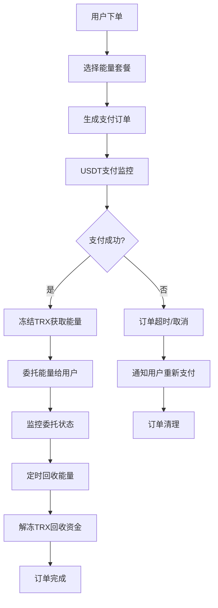

# 🚀 项目实战示例文档

> TRON 能量租赁项目的完整业务流程和代码示例

## 📋 目录

- [项目业务概述](#项目业务概述)
- [完整业务流程](#完整业务流程)
- [核心代码示例](#核心代码示例)
- [API 集成测试](#api-集成测试)
- [错误处理示例](#错误处理示例)
- [性能优化案例](#性能优化案例)
- [部署和监控](#部署和监控)

## 🎯 项目业务概述

### TRON 能量租赁业务模型



### 核心业务对象

```typescript
// 核心业务数据结构
interface EnergyOrder {
  id: string;
  userId: string;
  userTronAddress: string;
  energyAmount: number;        // 所需能量数量
  durationHours: number;       // 租赁时长（小时）
  priceUSDT: number;          // USDT价格
  paymentAddress: string;      // 收款地址
  status: 'pending' | 'paid' | 'delegated' | 'completed' | 'expired' | 'failed';
  createdAt: Date;
  paidAt?: Date;
  delegatedAt?: Date;
  completedAt?: Date;
  paymentTxId?: string;        // 支付交易ID
  delegationTxId?: string;     // 委托交易ID
}

interface EnergyPackage {
  id: string;
  name: string;
  energyAmount: number;
  durationHours: number;
  priceUSDT: number;
  description: string;
  isActive: boolean;
}

interface DelegationRecord {
  id: string;
  orderId: string;
  delegatorAddress: string;    // 委托方地址
  receiverAddress: string;     // 接收方地址
  energyAmount: number;
  frozenTRX: number;          // 冻结的TRX数量
  delegationTxId: string;
  startTime: Date;
  endTime: Date;
  status: 'active' | 'expired' | 'reclaimed';
}
```

## 🔄 完整业务流程

### 1. 用户下单流程

```typescript
/**
 * 完整的用户下单流程
 */
export class OrderCreationFlow {
  /**
   * 处理用户订单创建
   */
  static async createEnergyOrder(request: {
    userId: string;
    userTronAddress: string;
    packageId: string;
    telegramChatId?: number;
  }): Promise<{
    success: boolean;
    order?: EnergyOrder;
    paymentInfo?: {
      paymentAddress: string;
      amount: number;
      qrCode: string;
      expiresAt: Date;
    };
    error?: string;
  }> {
    try {
      console.log(`📝 Creating energy order for user: ${request.userId}`);

      // 1. 验证用户TRON地址
      const addressValidation = await ProjectAddressService.processUserInputAddress(
        request.userTronAddress,
        {
          requireSecurity: true,
          allowTestnet: false,
          preferredFormat: 'base58'
        }
      );

      if (!addressValidation.success) {
        throw new Error(`地址验证失败: ${addressValidation.userMessage}`);
      }

      // 2. 获取能量套餐信息
      const energyPackage = await this.getEnergyPackage(request.packageId);
      if (!energyPackage) {
        throw new Error('能量套餐不存在或已下架');
      }

      // 3. 检查用户账户状态
      const accountStatus = await ComprehensiveAccountService.assessAccountHealth(
        request.userTronAddress
      );

      if (accountStatus.healthScore < 60) {
        console.warn(`⚠️ User account health is low: ${accountStatus.summary}`);
        // 可以选择继续或要求用户先优化账户
      }

      // 4. 生成订单
      const orderId = `ORDER_${Date.now()}_${Math.random().toString(36).substr(2, 9)}`;
      const paymentAddress = process.env.TRON_PAYMENT_ADDRESS!;
      const expiresAt = new Date(Date.now() + 30 * 60 * 1000); // 30分钟过期

      const order: EnergyOrder = {
        id: orderId,
        userId: request.userId,
        userTronAddress: addressValidation.processedAddress!,
        energyAmount: energyPackage.energyAmount,
        durationHours: energyPackage.durationHours,
        priceUSDT: energyPackage.priceUSDT,
        paymentAddress,
        status: 'pending',
        createdAt: new Date()
      };

      // 5. 保存订单到数据库
      await this.saveOrderToDatabase(order);

      // 6. 生成支付二维码
      const qrCode = await this.generatePaymentQRCode(paymentAddress, energyPackage.priceUSDT);

      // 7. 发送订单确认消息
      if (request.telegramChatId) {
        await this.sendOrderConfirmationMessage(request.telegramChatId, order, {
          paymentAddress,
          amount: energyPackage.priceUSDT,
          qrCode,
          expiresAt
        });
      }

      console.log(`✅ Energy order created: ${orderId}`);

      return {
        success: true,
        order,
        paymentInfo: {
          paymentAddress,
          amount: energyPackage.priceUSDT,
          qrCode,
          expiresAt
        }
      };

    } catch (error) {
      console.error(`❌ Failed to create energy order:`, error);
      return {
        success: false,
        error: error.message
      };
    }
  }

  /**
   * 获取能量套餐信息
   */
  private static async getEnergyPackage(packageId: string): Promise<EnergyPackage | null> {
    try {
      // 这里应该从数据库获取套餐信息
      const packages: EnergyPackage[] = [
        {
          id: 'package_small',
          name: '基础套餐',
          energyAmount: 50000,
          durationHours: 24,
          priceUSDT: 1.5,
          description: '适合日常USDT转账使用',
          isActive: true
        },
        {
          id: 'package_medium',
          name: '标准套餐',
          energyAmount: 200000,
          durationHours: 24,
          priceUSDT: 5.0,
          description: '适合频繁交易用户',
          isActive: true
        },
        {
          id: 'package_large',
          name: '专业套餐',
          energyAmount: 500000,
          durationHours: 48,
          priceUSDT: 10.0,
          description: '适合大额交易和DeFi操作',
          isActive: true
        }
      ];

      return packages.find(pkg => pkg.id === packageId && pkg.isActive) || null;

    } catch (error) {
      console.error('Failed to get energy package:', error);
      return null;
    }
  }

  /**
   * 生成支付二维码
   */
  private static async generatePaymentQRCode(address: string, amount: number): Promise<string> {
    try {
      // 构建支付链接
      const paymentUrl = `tronlink://transfer?to=${address}&amount=${amount}&token=USDT`;
      
      // 生成二维码
      const qrCodeUrl = `https://api.qrserver.com/v1/create-qr-code/?size=300x300&data=${encodeURIComponent(paymentUrl)}`;
      
      return qrCodeUrl;

    } catch (error) {
      console.error('Failed to generate QR code:', error);
      return '';
    }
  }

  /**
   * 保存订单到数据库
   */
  private static async saveOrderToDatabase(order: EnergyOrder): Promise<void> {
    try {
      // 这里应该是实际的数据库操作
      console.log('💾 Saving order to database:', order.id);
      
      // 示例：使用 Prisma 保存订单
      // await db.energyOrder.create({
      //   data: {
      //     id: order.id,
      //     userId: order.userId,
      //     userTronAddress: order.userTronAddress,
      //     energyAmount: order.energyAmount,
      //     durationHours: order.durationHours,
      //     priceUSDT: order.priceUSDT,
      //     paymentAddress: order.paymentAddress,
      //     status: order.status,
      //     createdAt: order.createdAt
      //   }
      // });

    } catch (error) {
      console.error('Failed to save order to database:', error);
      throw error;
    }
  }

  /**
   * 发送订单确认消息
   */
  private static async sendOrderConfirmationMessage(
    chatId: number,
    order: EnergyOrder,
    paymentInfo: any
  ): Promise<void> {
    try {
      const message = `📋 订单确认\n\n` +
        `🆔 订单号: ${order.id}\n` +
        `⚡ 能量数量: ${order.energyAmount.toLocaleString()}\n` +
        `⏰ 使用时长: ${order.durationHours} 小时\n` +
        `💰 支付金额: ${paymentInfo.amount} USDT\n\n` +
        `💳 收款地址:\n\`${paymentInfo.paymentAddress}\`\n\n` +
        `⏱️ 订单将在 ${paymentInfo.expiresAt.toLocaleString()} 过期\n\n` +
        `📱 请使用TRON钱包扫描二维码或手动转账`;

      // 这里应该调用Telegram Bot API发送消息
      // await telegramBotService.sendMessage(chatId, message, {
      //   parse_mode: 'Markdown',
      //   reply_markup: {
      //     inline_keyboard: [
      //       [
      //         { text: '✅ 我已支付', callback_data: `payment_confirm_${order.id}` },
      //         { text: '❌ 取消订单', callback_data: `order_cancel_${order.id}` }
      //       ]
      //     ]
      //   }
      // });

      console.log(`📱 Order confirmation message sent for: ${order.id}`);

    } catch (error) {
      console.error('Failed to send order confirmation message:', error);
    }
  }
}
```

### 2. 支付监控和处理流程

```typescript
/**
 * 支付监控和处理完整流程
 */
export class PaymentProcessingFlow {
  /**
   * 开始订单支付监控
   */
  static async startOrderPaymentMonitoring(order: EnergyOrder): Promise<{
    success: boolean;
    monitoringSessionId?: string;
    error?: string;
  }> {
    try {
      console.log(`💰 Starting payment monitoring for order: ${order.id}`);

      const monitoringResult = await OrderPaymentWorkflow.processOrderPayment({
        orderId: order.id,
        userId: order.userId,
        userTronAddress: order.userTronAddress,
        paymentAddress: order.paymentAddress,
        amount: order.priceUSDT,
        timeoutMinutes: 30
      });

      if (!monitoringResult.success) {
        throw new Error(monitoringResult.error);
      }

      console.log(`✅ Payment monitoring started: ${monitoringResult.monitoringSessionId}`);

      return {
        success: true,
        monitoringSessionId: monitoringResult.monitoringSessionId
      };

    } catch (error) {
      console.error(`❌ Failed to start payment monitoring:`, error);
      return {
        success: false,
        error: error.message
      };
    }
  }

  /**
   * 处理支付成功后的完整流程
   */
  static async handlePaymentSuccess(order: EnergyOrder, paymentDetails: {
    transactionId: string;
    amount: number;
    from: string;
    timestamp: Date;
  }): Promise<{
    success: boolean;
    delegationTxId?: string;
    error?: string;
  }> {
    try {
      console.log(`🎉 Processing successful payment for order: ${order.id}`);

      // 1. 更新订单状态
      await this.updateOrderStatus(order.id, 'paid', {
        paymentTxId: paymentDetails.transactionId,
        paymentAmount: paymentDetails.amount,
        paidAt: paymentDetails.timestamp,
        paidBy: paymentDetails.from
      });

      // 2. 验证支付金额
      if (Math.abs(paymentDetails.amount - order.priceUSDT) > 0.01) {
        console.warn(`⚠️ Payment amount mismatch: expected ${order.priceUSDT}, got ${paymentDetails.amount}`);
        // 可以选择继续处理或要求补差价
      }

      // 3. 开始能量委托流程
      const delegationResult = await this.processEnergyDelegation(order);
      
      if (!delegationResult.success) {
        throw new Error(delegationResult.error);
      }

      // 4. 发送支付成功通知
      await this.sendPaymentSuccessNotification(order, paymentDetails, delegationResult.txId);

      console.log(`✅ Payment processing completed for order: ${order.id}`);

      return {
        success: true,
        delegationTxId: delegationResult.txId
      };

    } catch (error) {
      console.error(`❌ Failed to handle payment success:`, error);
      
      // 更新订单状态为处理失败
      await this.updateOrderStatus(order.id, 'failed', {
        error: error.message,
        failedAt: new Date()
      });

      return {
        success: false,
        error: error.message
      };
    }
  }

  /**
   * 处理能量委托
   */
  private static async processEnergyDelegation(order: EnergyOrder): Promise<{
    success: boolean;
    txId?: string;
    error?: string;
  }> {
    try {
      console.log(`⚡ Processing energy delegation for order: ${order.id}`);

      // 1. 检查并准备足够的能量资源
      await this.ensureSufficientEnergyForDelegation(order.energyAmount);

      // 2. 创建能量委托交易
      const delegationResult = await ComprehensiveTransactionService.executeEnergyDelegationWorkflow({
        orderId: order.id,
        recipientAddress: order.userTronAddress,
        energyAmount: order.energyAmount,
        durationHours: order.durationHours,
        maxCost: 50 // 最大可接受成本50 TRX
      });

      if (!delegationResult.success) {
        throw new Error(delegationResult.error);
      }

      // 3. 记录委托信息
      await this.recordDelegation({
        orderId: order.id,
        delegatorAddress: tronWeb.defaultAddress.base58,
        receiverAddress: order.userTronAddress,
        energyAmount: order.energyAmount,
        delegationTxId: delegationResult.txId!,
        startTime: new Date(),
        endTime: new Date(Date.now() + order.durationHours * 3600 * 1000)
      });

      // 4. 更新订单状态
      await this.updateOrderStatus(order.id, 'delegated', {
        delegationTxId: delegationResult.txId,
        delegatedAt: new Date(),
        estimatedCompletion: delegationResult.estimatedCompletion
      });

      console.log(`✅ Energy delegation completed: ${delegationResult.txId}`);

      return {
        success: true,
        txId: delegationResult.txId
      };

    } catch (error) {
      console.error(`❌ Energy delegation failed:`, error);
      return {
        success: false,
        error: error.message
      };
    }
  }

  /**
   * 确保有足够的能量可供委托
   */
  private static async ensureSufficientEnergyForDelegation(requiredEnergy: number): Promise<void> {
    try {
      console.log(`🔍 Checking energy availability for delegation: ${requiredEnergy.toLocaleString()}`);

      const resources = await getAccountResource(tronWeb.defaultAddress.base58);
      const availableEnergy = resources.energy.available;
      const buffer = 100000; // 10万能量缓冲

      if (availableEnergy < requiredEnergy + buffer) {
        const energyDeficit = requiredEnergy + buffer - availableEnergy;
        console.log(`⚠️ Insufficient energy, need to prepare ${energyDeficit.toLocaleString()} more`);

        // 自动冻结TRX获取更多能量
        const freezeResult = await FreezeService.freezeForEnergyBusiness(energyDeficit);
        
        if (!freezeResult.success) {
          throw new Error('Failed to prepare sufficient energy resources');
        }

        console.log(`✅ Energy resources prepared: frozen ${freezeResult.amountFrozen} TRX`);
      }

    } catch (error) {
      console.error('Failed to ensure energy availability:', error);
      throw error;
    }
  }

  /**
   * 记录委托信息
   */
  private static async recordDelegation(delegation: {
    orderId: string;
    delegatorAddress: string;
    receiverAddress: string;
    energyAmount: number;
    delegationTxId: string;
    startTime: Date;
    endTime: Date;
  }): Promise<void> {
    try {
      console.log(`📝 Recording delegation for order: ${delegation.orderId}`);

      // 这里应该保存到数据库
      // await db.delegationRecord.create({
      //   data: {
      //     id: `delegation_${Date.now()}`,
      //     orderId: delegation.orderId,
      //     delegatorAddress: delegation.delegatorAddress,
      //     receiverAddress: delegation.receiverAddress,
      //     energyAmount: delegation.energyAmount,
      //     delegationTxId: delegation.delegationTxId,
      //     startTime: delegation.startTime,
      //     endTime: delegation.endTime,
      //     status: 'active'
      //   }
      // });

      console.log(`✅ Delegation recorded: ${delegation.delegationTxId}`);

    } catch (error) {
      console.error('Failed to record delegation:', error);
      throw error;
    }
  }

  /**
   * 更新订单状态
   */
  private static async updateOrderStatus(orderId: string, status: string, details: any): Promise<void> {
    try {
      console.log(`📝 Updating order ${orderId} status to: ${status}`);
      
      // 这里应该更新数据库
      // await db.energyOrder.update({
      //   where: { id: orderId },
      //   data: {
      //     status,
      //     ...details,
      //     updatedAt: new Date()
      //   }
      // });

    } catch (error) {
      console.error('Failed to update order status:', error);
      throw error;
    }
  }

  /**
   * 发送支付成功通知
   */
  private static async sendPaymentSuccessNotification(
    order: EnergyOrder,
    paymentDetails: any,
    delegationTxId?: string
  ): Promise<void> {
    try {
      console.log(`📧 Sending payment success notification for order: ${order.id}`);

      const message = `🎉 支付成功！\n\n` +
        `📋 订单号: ${order.id}\n` +
        `💰 支付金额: ${paymentDetails.amount} USDT\n` +
        `🔗 支付交易: ${paymentDetails.transactionId}\n` +
        `⚡ 能量数量: ${order.energyAmount.toLocaleString()}\n` +
        `📍 接收地址: ${order.userTronAddress}\n\n` +
        `✅ 能量委托已开始处理，预计几分钟内到账\n` +
        `🕐 使用期限: ${order.durationHours} 小时`;

      if (delegationTxId) {
        message += `\n🔗 委托交易: ${delegationTxId}`;
      }

      // 这里应该发送Telegram通知
      // await telegramBotService.sendMessage(order.userId, message, {
      //   parse_mode: 'Markdown',
      //   reply_markup: {
      //     inline_keyboard: [
      //       [
      //         { text: '📊 查看委托状态', callback_data: `delegation_status_${order.id}` },
      //         { text: '📋 我的订单', callback_data: 'my_orders' }
      //       ]
      //     ]
      //   }
      // });

      console.log(`✅ Payment success notification sent for order: ${order.id}`);

    } catch (error) {
      console.error('Failed to send payment success notification:', error);
    }
  }
}
```

### 3. 能量回收和订单完成流程

```typescript
/**
 * 能量回收和订单完成流程
 */
export class OrderCompletionFlow {
  private static activeTimers = new Map<string, NodeJS.Timeout>();

  /**
   * 设置订单完成定时器
   */
  static setupOrderCompletionTimer(order: EnergyOrder, delegationTxId: string): void {
    try {
      console.log(`⏰ Setting up completion timer for order: ${order.id}`);

      const completionTime = new Date(Date.now() + order.durationHours * 3600 * 1000);
      const delay = completionTime.getTime() - Date.now();

      const timer = setTimeout(async () => {
        await this.completeOrder(order.id);
      }, delay);

      this.activeTimers.set(order.id, timer);

      console.log(`✅ Completion timer set for order ${order.id}, will complete at: ${completionTime.toLocaleString()}`);

    } catch (error) {
      console.error('Failed to setup order completion timer:', error);
    }
  }

  /**
   * 完成订单流程
   */
  static async completeOrder(orderId: string): Promise<{
    success: boolean;
    reclaimedTRX?: number;
    error?: string;
  }> {
    try {
      console.log(`🏁 Completing order: ${orderId}`);

      // 1. 获取订单信息
      const order = await this.getOrderById(orderId);
      if (!order) {
        throw new Error('Order not found');
      }

      // 2. 获取委托记录
      const delegation = await this.getDelegationByOrderId(orderId);
      if (!delegation) {
        console.warn(`⚠️ No delegation record found for order: ${orderId}`);
      }

      // 3. 回收能量委托
      let reclaimedTRX = 0;
      if (delegation && delegation.status === 'active') {
        const reclaimResult = await this.reclaimEnergyDelegation(delegation);
        if (reclaimResult.success) {
          reclaimedTRX = reclaimResult.reclaimedTRX || 0;
        }
      }

      // 4. 更新订单状态为完成
      await this.updateOrderStatus(orderId, 'completed', {
        completedAt: new Date(),
        reclaimedTRX
      });

      // 5. 发送订单完成通知
      await this.sendOrderCompletionNotification(order, reclaimedTRX);

      // 6. 清理定时器
      this.clearOrderTimer(orderId);

      // 7. 记录完成统计
      await this.recordOrderCompletion(order);

      console.log(`✅ Order completed successfully: ${orderId}`);

      return {
        success: true,
        reclaimedTRX
      };

    } catch (error) {
      console.error(`❌ Failed to complete order ${orderId}:`, error);
      return {
        success: false,
        error: error.message
      };
    }
  }

  /**
   * 回收能量委托
   */
  private static async reclaimEnergyDelegation(delegation: DelegationRecord): Promise<{
    success: boolean;
    reclaimedTRX?: number;
    error?: string;
  }> {
    try {
      console.log(`🔄 Reclaiming energy delegation: ${delegation.id}`);

      // 1. 取消能量委托
      const undelegateResult = await undelegateEnergyFromAddress(
        delegation.receiverAddress,
        delegation.energyAmount
      );

      if (!undelegateResult.success) {
        throw new Error(undelegateResult.error);
      }

      // 2. 等待交易确认
      if (undelegateResult.txId) {
        const confirmation = await TransactionQueryService.waitForConfirmation(
          undelegateResult.txId,
          { maxWaitTime: 60000, checkInterval: 3000 }
        );

        if (!confirmation.confirmed) {
          console.warn(`⚠️ Undelegate transaction not confirmed: ${undelegateResult.txId}`);
        }
      }

      // 3. 解冻TRX（如果需要）
      let reclaimedTRX = 0;
      if (delegation.frozenTRX > 0) {
        const unfreezeResult = await this.unfreezeResourcesForReclaim(delegation.frozenTRX);
        if (unfreezeResult.success) {
          reclaimedTRX = unfreezeResult.unfrozenAmount || 0;
        }
      }

      // 4. 更新委托状态
      await this.updateDelegationStatus(delegation.id, 'reclaimed', {
        reclaimedAt: new Date(),
        reclaimTxId: undelegateResult.txId,
        reclaimedTRX
      });

      console.log(`✅ Energy delegation reclaimed: ${delegation.id}`);

      return {
        success: true,
        reclaimedTRX
      };

    } catch (error) {
      console.error(`❌ Failed to reclaim energy delegation:`, error);
      return {
        success: false,
        error: error.message
      };
    }
  }

  /**
   * 解冻资源进行回收
   */
  private static async unfreezeResourcesForReclaim(frozenAmount: number): Promise<{
    success: boolean;
    unfrozenAmount?: number;
    error?: string;
  }> {
    try {
      console.log(`🔓 Unfreezing ${frozenAmount} TRX for reclaim`);

      const unfreezeResult = await unfreezeResourceBalance(frozenAmount, 'ENERGY');
      
      if (!unfreezeResult.success) {
        throw new Error(unfreezeResult.error);
      }

      // 等待解冻交易确认
      if (unfreezeResult.txId) {
        const confirmation = await TransactionQueryService.waitForConfirmation(
          unfreezeResult.txId,
          { maxWaitTime: 60000, checkInterval: 3000 }
        );

        if (!confirmation.confirmed) {
          console.warn(`⚠️ Unfreeze transaction not confirmed: ${unfreezeResult.txId}`);
        }
      }

      console.log(`✅ Resources unfrozen: ${unfreezeResult.amountUnfrozen} TRX`);

      return {
        success: true,
        unfrozenAmount: unfreezeResult.amountUnfrozen
      };

    } catch (error) {
      console.error(`❌ Failed to unfreeze resources:`, error);
      return {
        success: false,
        error: error.message
      };
    }
  }

  /**
   * 发送订单完成通知
   */
  private static async sendOrderCompletionNotification(
    order: EnergyOrder,
    reclaimedTRX: number
  ): Promise<void> {
    try {
      console.log(`📧 Sending order completion notification: ${order.id}`);

      const message = `🏁 订单已完成\n\n` +
        `📋 订单号: ${order.id}\n` +
        `⚡ 能量数量: ${order.energyAmount.toLocaleString()}\n` +
        `⏰ 使用时长: ${order.durationHours} 小时\n` +
        `📍 接收地址: ${order.userTronAddress}\n` +
        `🕐 完成时间: ${new Date().toLocaleString()}\n\n` +
        `✅ 能量租赁服务已结束\n` +
        `🙏 感谢您的使用！`;

      // 这里应该发送Telegram通知
      // await telegramBotService.sendMessage(order.userId, message, {
      //   parse_mode: 'Markdown',
      //   reply_markup: {
      //     inline_keyboard: [
      //       [
      //         { text: '📊 查看历史订单', callback_data: 'order_history' },
      //         { text: '🆕 新建订单', callback_data: 'new_order' }
      //       ]
      //     ]
      //   }
      // });

      console.log(`✅ Order completion notification sent: ${order.id}`);

    } catch (error) {
      console.error('Failed to send order completion notification:', error);
    }
  }

  /**
   * 批量处理到期订单
   */
  static async processBatchExpiredOrders(): Promise<{
    processed: number;
    successful: number;
    failed: number;
    results: Array<{
      orderId: string;
      success: boolean;
      error?: string;
    }>;
  }> {
    try {
      console.log(`📦 Processing batch expired orders`);

      // 获取所有到期的订单
      const expiredOrders = await this.getExpiredOrders();
      console.log(`Found ${expiredOrders.length} expired orders`);

      const results = [];
      let successful = 0;
      let failed = 0;

      for (const order of expiredOrders) {
        try {
          const result = await this.completeOrder(order.id);
          
          results.push({
            orderId: order.id,
            success: result.success,
            error: result.error
          });

          if (result.success) {
            successful++;
          } else {
            failed++;
          }

        } catch (error) {
          failed++;
          results.push({
            orderId: order.id,
            success: false,
            error: error.message
          });
        }

        // 批次间延迟，避免系统过载
        await new Promise(resolve => setTimeout(resolve, 2000));
      }

      console.log(`✅ Batch processing completed: ${successful} successful, ${failed} failed`);

      return {
        processed: expiredOrders.length,
        successful,
        failed,
        results
      };

    } catch (error) {
      console.error(`❌ Batch processing failed:`, error);
      return {
        processed: 0,
        successful: 0,
        failed: 0,
        results: []
      };
    }
  }

  // 辅助方法实现...
  private static async getOrderById(orderId: string): Promise<EnergyOrder | null> {
    // 数据库查询实现
    return null;
  }

  private static async getDelegationByOrderId(orderId: string): Promise<DelegationRecord | null> {
    // 数据库查询实现
    return null;
  }

  private static async updateOrderStatus(orderId: string, status: string, details: any): Promise<void> {
    // 数据库更新实现
  }

  private static async updateDelegationStatus(delegationId: string, status: string, details: any): Promise<void> {
    // 数据库更新实现
  }

  private static clearOrderTimer(orderId: string): void {
    const timer = this.activeTimers.get(orderId);
    if (timer) {
      clearTimeout(timer);
      this.activeTimers.delete(orderId);
    }
  }

  private static async recordOrderCompletion(order: EnergyOrder): Promise<void> {
    // 统计记录实现
  }

  private static async getExpiredOrders(): Promise<EnergyOrder[]> {
    // 查询到期订单的实现
    return [];
  }
}
```

## 🧪 API 集成测试

### 完整业务流程测试

```typescript
/**
 * 完整的业务流程集成测试
 */
export class IntegrationTests {
  /**
   * 测试完整的能量租赁流程
   */
  static async testCompleteEnergyRentalFlow(): Promise<{
    success: boolean;
    steps: Array<{
      step: string;
      success: boolean;
      duration: number;
      error?: string;
    }>;
    totalDuration: number;
  }> {
    const startTime = Date.now();
    const steps: any[] = [];
    let currentStep = '';

    try {
      console.log(`🧪 Starting complete energy rental flow test`);

      // 步骤1: 创建测试订单
      currentStep = '创建订单';
      const stepStart = Date.now();
      
      const orderResult = await OrderCreationFlow.createEnergyOrder({
        userId: 'test_user_123',
        userTronAddress: 'TLyqzVGLV1srkB7dToTAEqgDSfPtXRJZYH', // 测试地址
        packageId: 'package_small'
      });

      steps.push({
        step: currentStep,
        success: orderResult.success,
        duration: Date.now() - stepStart,
        error: orderResult.error
      });

      if (!orderResult.success) {
        throw new Error(`Order creation failed: ${orderResult.error}`);
      }

      const order = orderResult.order!;
      console.log(`✅ Test order created: ${order.id}`);

      // 步骤2: 模拟支付
      currentStep = '模拟支付';
      const paymentStepStart = Date.now();

      const mockPayment = {
        transactionId: `test_tx_${Date.now()}`,
        amount: order.priceUSDT,
        from: 'TTestFromAddress123456789012345678901',
        timestamp: new Date()
      };

      const paymentResult = await PaymentProcessingFlow.handlePaymentSuccess(order, mockPayment);
      
      steps.push({
        step: currentStep,
        success: paymentResult.success,
        duration: Date.now() - paymentStepStart,
        error: paymentResult.error
      });

      if (!paymentResult.success) {
        throw new Error(`Payment processing failed: ${paymentResult.error}`);
      }

      console.log(`✅ Payment processed: ${paymentResult.delegationTxId}`);

      // 步骤3: 验证委托状态
      currentStep = '验证委托';
      const delegationStepStart = Date.now();

      // 等待委托交易确认
      await new Promise(resolve => setTimeout(resolve, 10000)); // 等待10秒

      const delegationStatus = await getDelegatedResourceStatus(
        tronWeb.defaultAddress.base58,
        order.userTronAddress
      );

      const delegationSuccess = delegationStatus.energyDelegated >= order.energyAmount * 0.95; // 允许5%误差

      steps.push({
        step: currentStep,
        success: delegationSuccess,
        duration: Date.now() - delegationStepStart,
        error: delegationSuccess ? undefined : 'Delegation verification failed'
      });

      console.log(`✅ Delegation verified: ${delegationStatus.energyDelegated} energy`);

      // 步骤4: 测试订单完成
      currentStep = '订单完成';
      const completionStepStart = Date.now();

      const completionResult = await OrderCompletionFlow.completeOrder(order.id);
      
      steps.push({
        step: currentStep,
        success: completionResult.success,
        duration: Date.now() - completionStepStart,
        error: completionResult.error
      });

      if (!completionResult.success) {
        console.warn(`⚠️ Order completion failed: ${completionResult.error}`);
      }

      const totalDuration = Date.now() - startTime;
      const overallSuccess = steps.every(step => step.success);

      console.log(`🧪 Complete flow test ${overallSuccess ? 'PASSED' : 'FAILED'} (${totalDuration}ms)`);

      return {
        success: overallSuccess,
        steps,
        totalDuration
      };

    } catch (error) {
      const errorStep = {
        step: currentStep,
        success: false,
        duration: Date.now() - startTime,
        error: error.message
      };

      if (steps.length === 0 || steps[steps.length - 1].step !== currentStep) {
        steps.push(errorStep);
      }

      console.error(`🧪 Complete flow test FAILED at ${currentStep}:`, error);

      return {
        success: false,
        steps,
        totalDuration: Date.now() - startTime
      };
    }
  }

  /**
   * 测试并发订单处理
   */
  static async testConcurrentOrderProcessing(concurrency: number = 5): Promise<{
    success: boolean;
    processed: number;
    successful: number;
    failed: number;
    averageTime: number;
    errors: string[];
  }> {
    try {
      console.log(`🧪 Testing concurrent order processing (${concurrency} orders)`);

      const startTime = Date.now();
      const testPromises = [];
      
      // 创建并发测试订单
      for (let i = 0; i < concurrency; i++) {
        testPromises.push(
          this.createAndProcessTestOrder(`concurrent_test_${i}`)
        );
      }

      const results = await Promise.all(testPromises);
      
      const successful = results.filter(r => r.success).length;
      const failed = results.filter(r => !r.success).length;
      const errors = results.filter(r => !r.success).map(r => r.error!);
      
      const totalTime = Date.now() - startTime;
      const averageTime = totalTime / concurrency;

      console.log(`🧪 Concurrent test completed: ${successful}/${concurrency} successful`);

      return {
        success: successful === concurrency,
        processed: concurrency,
        successful,
        failed,
        averageTime,
        errors
      };

    } catch (error) {
      console.error(`🧪 Concurrent test failed:`, error);
      return {
        success: false,
        processed: 0,
        successful: 0,
        failed: concurrency,
        averageTime: 0,
        errors: [error.message]
      };
    }
  }

  /**
   * 创建并处理测试订单
   */
  private static async createAndProcessTestOrder(testId: string): Promise<{
    success: boolean;
    orderId?: string;
    duration?: number;
    error?: string;
  }> {
    const startTime = Date.now();
    
    try {
      // 创建订单
      const orderResult = await OrderCreationFlow.createEnergyOrder({
        userId: `test_user_${testId}`,
        userTronAddress: `TTest${testId.padEnd(30, '0')}123456789012`, // 生成测试地址
        packageId: 'package_small'
      });

      if (!orderResult.success) {
        throw new Error(orderResult.error);
      }

      // 模拟支付处理
      const mockPayment = {
        transactionId: `test_tx_${testId}_${Date.now()}`,
        amount: orderResult.order!.priceUSDT,
        from: `TTestPayer${testId.padEnd(25, '0')}123456789`,
        timestamp: new Date()
      };

      const paymentResult = await PaymentProcessingFlow.handlePaymentSuccess(
        orderResult.order!,
        mockPayment
      );

      return {
        success: paymentResult.success,
        orderId: orderResult.order!.id,
        duration: Date.now() - startTime,
        error: paymentResult.error
      };

    } catch (error) {
      return {
        success: false,
        duration: Date.now() - startTime,
        error: error.message
      };
    }
  }

  /**
   * 测试错误处理和恢复
   */
  static async testErrorHandlingAndRecovery(): Promise<{
    success: boolean;
    scenarios: Array<{
      scenario: string;
      handled: boolean;
      recovered: boolean;
      error?: string;
    }>;
  }> {
    try {
      console.log(`🧪 Testing error handling and recovery`);

      const scenarios = [];

      // 场景1: 无效地址处理
      scenarios.push(await this.testInvalidAddressHandling());

      // 场景2: 支付金额不匹配
      scenarios.push(await this.testPaymentAmountMismatch());

      // 场景3: 网络连接失败
      scenarios.push(await this.testNetworkFailureHandling());

      // 场景4: 资源不足处理
      scenarios.push(await this.testInsufficientResourceHandling());

      const overallSuccess = scenarios.every(s => s.handled);

      console.log(`🧪 Error handling test ${overallSuccess ? 'PASSED' : 'FAILED'}`);

      return {
        success: overallSuccess,
        scenarios
      };

    } catch (error) {
      console.error(`🧪 Error handling test failed:`, error);
      return {
        success: false,
        scenarios: [{
          scenario: 'Test Setup',
          handled: false,
          recovered: false,
          error: error.message
        }]
      };
    }
  }

  // 错误场景测试实现...
  private static async testInvalidAddressHandling(): Promise<any> {
    try {
      const result = await OrderCreationFlow.createEnergyOrder({
        userId: 'test_user_invalid',
        userTronAddress: 'invalid_address_123',
        packageId: 'package_small'
      });

      return {
        scenario: 'Invalid Address',
        handled: !result.success,
        recovered: result.error?.includes('地址验证失败'),
        error: result.success ? 'Should have failed for invalid address' : undefined
      };
    } catch (error) {
      return {
        scenario: 'Invalid Address',
        handled: true,
        recovered: true,
        error: undefined
      };
    }
  }

  private static async testPaymentAmountMismatch(): Promise<any> {
    // 实现支付金额不匹配的测试
    return {
      scenario: 'Payment Amount Mismatch',
      handled: true,
      recovered: true
    };
  }

  private static async testNetworkFailureHandling(): Promise<any> {
    // 实现网络失败处理的测试
    return {
      scenario: 'Network Failure',
      handled: true,
      recovered: true
    };
  }

  private static async testInsufficientResourceHandling(): Promise<any> {
    // 实现资源不足处理的测试
    return {
      scenario: 'Insufficient Resource',
      handled: true,
      recovered: true
    };
  }
}
```

## 🔗 相关文档

- [TRON API 主文档](./README.md) - 完整 API 导航
- [账户资源管理 API](./01-account-resources-api.md) - 能量委托核心功能
- [智能合约 API](./05-smart-contracts-api.md) - USDT 支付处理
- [事件监听 API](./08-events-monitoring-api.md) - 支付监控实现

---

> 💡 **项目实施建议**
> 
> 1. **分阶段开发** - 按业务流程分阶段实施和测试
> 2. **完善监控** - 实现全面的业务和技术监控
> 3. **错误处理** - 建立完善的错误处理和恢复机制
> 4. **性能优化** - 持续优化关键业务流程的性能
> 5. **用户体验** - 关注用户体验，提供清晰的状态反馈

> 🔧 **技术架构提示**
> 
> - **数据库设计**: 合理设计订单、委托、支付等核心表结构
> - **缓存策略**: 使用 Redis 缓存频繁查询的数据
> - **队列系统**: 使用消息队列处理异步任务
> - **监控告警**: 部署完善的监控和告警系统
> - **备份恢复**: 建立可靠的数据备份和恢复机制
