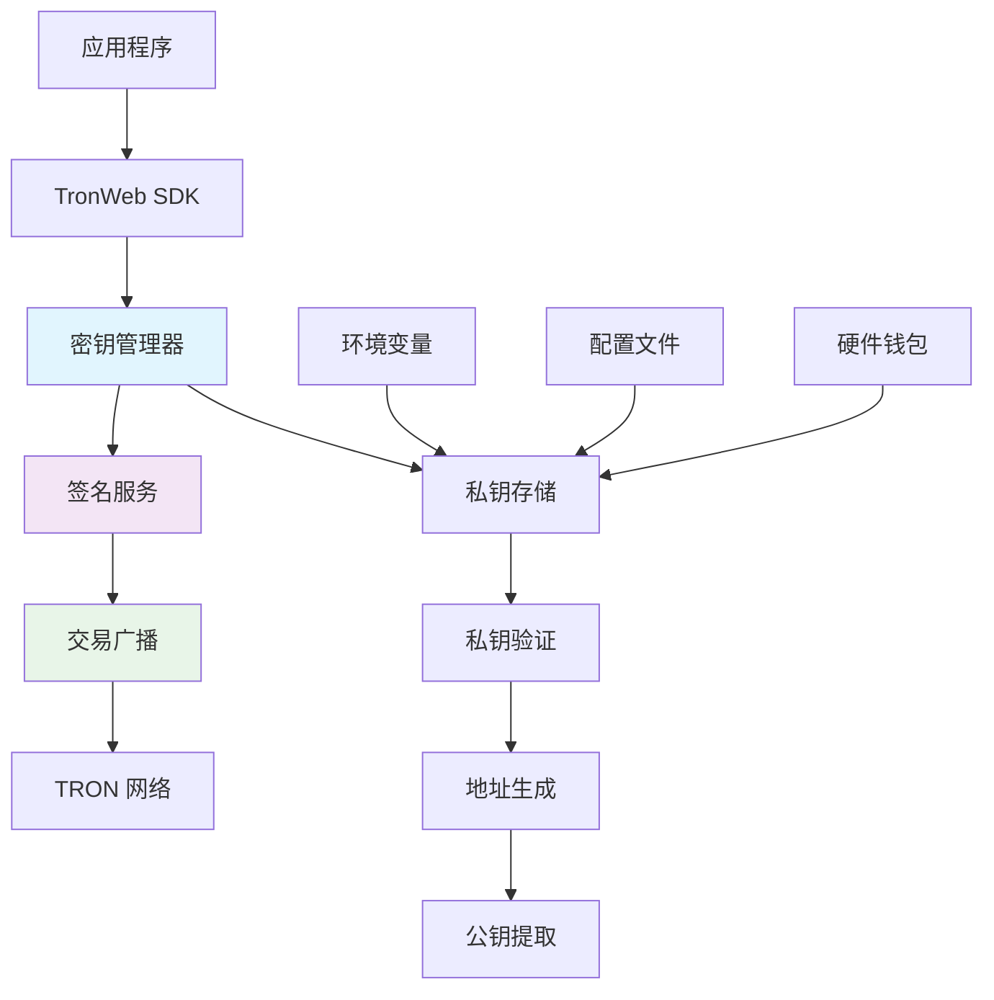
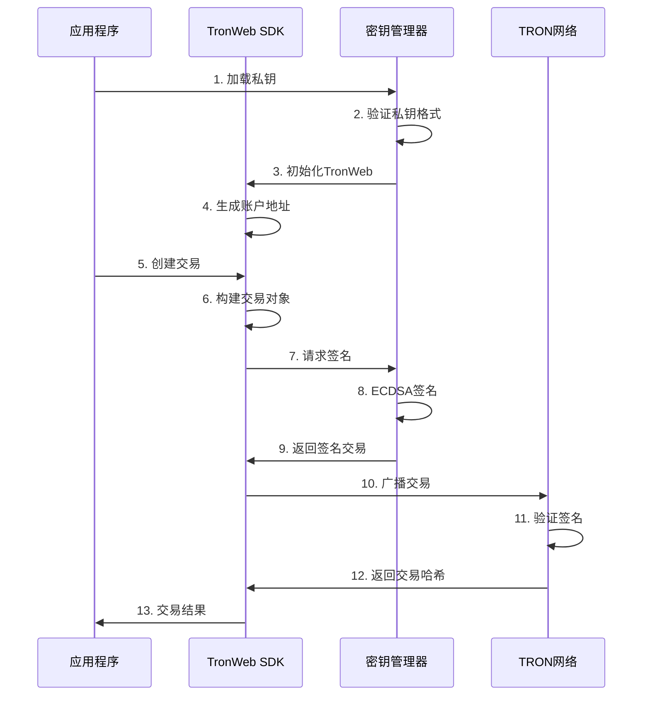

# 🔐 密钥认证与交易广播 API 详细文档

> TRON 网络密钥管理、交易签名、交易广播的完整接口指南

## 📋 目录

- [认证系统概述](#认证系统概述)
- [密钥管理接口](#密钥管理接口)
- [交易签名接口](#交易签名接口)
- [交易广播接口](#交易广播接口)
- [认证流程实战](#认证流程实战)
- [安全配置](#安全配置)
- [错误处理](#错误处理)

## 🎯 认证系统概述

### TRON 密钥认证架构



### 核心认证流程



## 🔑 密钥管理接口

### 1. TronWeb 初始化接口

#### `initializeTronWeb(config: TronConfig)`

**接口描述**: 初始化 TronWeb 实例并设置私钥认证

```typescript
/**
 * TronWeb 初始化配置接口
 */
interface TronConfig {
  fullHost: string;          // TRON节点地址
  privateKey?: string;       // 64位十六进制私钥
  solidityNode?: string;     // Solidity节点（可选）
  eventServer?: string;      // 事件服务器（可选）
  headers?: {                // API请求头
    "TRON-PRO-API-KEY"?: string;
  };
}

/**
 * 初始化 TronWeb 实例
 */
async function initializeTronWeb(config: TronConfig): Promise<{
  success: boolean;
  tronWeb?: any;
  address?: string;
  error?: string;
}> {
  try {
    console.log('🔧 Initializing TronWeb with authentication...');

    // 1. 创建TronWeb实例
    const tronWeb = new TronWeb({
      fullHost: config.fullHost,
      headers: config.headers || {}
    });

    // 2. 设置私钥（如果提供）
    if (config.privateKey && config.privateKey.length === 64) {
      tronWeb.setPrivateKey(config.privateKey);
      
      // 3. 验证私钥有效性
      const address = tronWeb.address.fromPrivateKey(config.privateKey);
      console.log('✅ TronWeb initialized with address:', address);

      return {
        success: true,
        tronWeb,
        address
      };
    }

    return {
      success: true,
      tronWeb
    };

  } catch (error) {
    console.error('❌ Failed to initialize TronWeb:', error);
    return {
      success: false,
      error: error.message
    };
  }
}
```

#### 使用示例

```typescript
// 环境变量配置
const config: TronConfig = {
  fullHost: 'https://api.trongrid.io',
  privateKey: process.env.TRON_PRIVATE_KEY,
  headers: {
    "TRON-PRO-API-KEY": process.env.TRON_API_KEY
  }
};

// 初始化TronWeb
const result = await initializeTronWeb(config);
if (result.success) {
  console.log('TronWeb初始化成功，地址:', result.address);
} else {
  console.error('初始化失败:', result.error);
}
```

### 2. 私钥验证接口

#### `validatePrivateKey(privateKey: string)`

**接口描述**: 验证私钥格式和安全性

```typescript
interface PrivateKeyValidationResult {
  valid: boolean;
  address?: string;
  publicKey?: string;
  issues?: string[];
}

/**
 * 验证私钥
 * @param privateKey 64位十六进制私钥
 */
function validatePrivateKey(privateKey: string): PrivateKeyValidationResult {
  try {
    const issues: string[] = [];

    // 1. 格式验证
    if (!privateKey || typeof privateKey !== 'string') {
      issues.push('私钥必须是有效的字符串');
    }

    if (!/^[0-9a-fA-F]{64}$/.test(privateKey)) {
      issues.push('私钥必须是64位十六进制字符串');
    }

    // 2. 安全性验证
    const keyBigInt = BigInt('0x' + privateKey);
    const maxKey = BigInt('0xFFFFFFFFFFFFFFFFFFFFFFFFFFFFFFFEBAAEDCE6AF48A03BBFD25E8CD0364141');
    
    if (keyBigInt <= 0n) {
      issues.push('私钥不能为0');
    }

    if (keyBigInt >= maxKey) {
      issues.push('私钥超出有效范围');
    }

    // 3. 弱私钥检测
    const weakKeys = [
      '0000000000000000000000000000000000000000000000000000000000000001',
      'FFFFFFFFFFFFFFFFFFFFFFFFFFFFFFFFFFFFFFFFFFFFFFFFFFFFFFFFFFFFFFFF'
    ];

    if (weakKeys.includes(privateKey.toUpperCase())) {
      issues.push('检测到弱私钥，存在安全风险');
    }

    if (issues.length > 0) {
      return { valid: false, issues };
    }

    // 4. 生成地址验证
    const address = TronWeb.address.fromPrivateKey(privateKey);
    const publicKey = TronWeb.utils.accounts.generateAccount().publicKey;

    return {
      valid: true,
      address: address,
      publicKey: publicKey
    };

  } catch (error) {
    return {
      valid: false,
      issues: [`私钥验证失败: ${error.message}`]
    };
  }
}
```

## ✍️ 交易签名接口

### 1. 通用签名接口

#### `signTransaction(transaction: any)`

**接口描述**: 使用私钥对交易进行数字签名

```typescript
interface SignTransactionResult {
  success: boolean;
  signedTransaction?: any;
  signature?: string;
  txID?: string;
  error?: string;
}

/**
 * 签名交易
 * @param tronWeb 已初始化的TronWeb实例
 * @param transaction 未签名的交易对象
 */
async function signTransaction(
  tronWeb: any, 
  transaction: any
): Promise<SignTransactionResult> {
  try {
    console.log('✍️ Signing transaction:', transaction.txID);

    // 1. 验证交易对象
    if (!transaction || !transaction.raw_data) {
      throw new Error('Invalid transaction object');
    }

    // 2. 检查私钥是否设置
    if (!tronWeb.defaultPrivateKey) {
      throw new Error('Private key not set in TronWeb instance');
    }

    // 3. 执行签名
    const signedTransaction = await tronWeb.trx.sign(transaction);

    // 4. 验证签名
    if (!signedTransaction.signature || signedTransaction.signature.length === 0) {
      throw new Error('Transaction signing failed - no signature generated');
    }

    console.log('✅ Transaction signed successfully');
    console.log('  TX ID:', signedTransaction.txID);
    console.log('  Signature:', signedTransaction.signature[0]);

    return {
      success: true,
      signedTransaction,
      signature: signedTransaction.signature[0],
      txID: signedTransaction.txID
    };

  } catch (error) {
    console.error('❌ Transaction signing failed:', error);
    return {
      success: false,
      error: error.message
    };
  }
}
```

### 2. 批量签名接口

#### `signMultipleTransactions(transactions: any[])`

**接口描述**: 批量签名多个交易

```typescript
interface BatchSignResult {
  success: boolean;
  signedTransactions: any[];
  failed: Array<{
    index: number;
    transaction: any;
    error: string;
  }>;
  totalSigned: number;
  totalFailed: number;
}

/**
 * 批量签名交易
 */
async function signMultipleTransactions(
  tronWeb: any, 
  transactions: any[]
): Promise<BatchSignResult> {
  console.log(`📝 Batch signing ${transactions.length} transactions...`);

  const signedTransactions: any[] = [];
  const failed: Array<{index: number, transaction: any, error: string}> = [];

  for (let i = 0; i < transactions.length; i++) {
    try {
      const result = await signTransaction(tronWeb, transactions[i]);
      
      if (result.success) {
        signedTransactions.push(result.signedTransaction);
      } else {
        failed.push({
          index: i,
          transaction: transactions[i],
          error: result.error || 'Unknown signing error'
        });
      }
    } catch (error) {
      failed.push({
        index: i,
        transaction: transactions[i],
        error: error.message
      });
    }
  }

  console.log(`✅ Batch signing completed: ${signedTransactions.length} success, ${failed.length} failed`);

  return {
    success: failed.length === 0,
    signedTransactions,
    failed,
    totalSigned: signedTransactions.length,
    totalFailed: failed.length
  };
}
```

## 📡 交易广播接口

### 1. 单个交易广播

#### `broadcastTransaction(signedTransaction: any)`

**接口描述**: 将已签名的交易广播到TRON网络

```typescript
interface BroadcastResult {
  success: boolean;
  txid?: string;
  result?: boolean;
  message?: string;
  code?: string;
  error?: string;
}

/**
 * 广播交易到TRON网络
 * @param tronWeb TronWeb实例
 * @param signedTransaction 已签名的交易
 */
async function broadcastTransaction(
  tronWeb: any, 
  signedTransaction: any
): Promise<BroadcastResult> {
  try {
    console.log('📡 Broadcasting transaction:', signedTransaction.txID);

    // 1. 验证已签名交易
    if (!signedTransaction || !signedTransaction.signature) {
      throw new Error('Invalid signed transaction - missing signature');
    }

    // 2. 广播交易
    const broadcastResult = await tronWeb.trx.sendRawTransaction(signedTransaction);

    // 3. 检查广播结果
    if (broadcastResult.result === true) {
      console.log('✅ Transaction broadcast successful:', broadcastResult.txid || signedTransaction.txID);
      
      return {
        success: true,
        txid: broadcastResult.txid || signedTransaction.txID,
        result: broadcastResult.result,
        message: broadcastResult.message || 'Transaction broadcast successful'
      };
    } else {
      console.warn('⚠️ Transaction broadcast failed:', broadcastResult);
      
      return {
        success: false,
        result: broadcastResult.result,
        message: broadcastResult.message || 'Transaction broadcast failed',
        code: broadcastResult.code,
        error: broadcastResult.message
      };
    }

  } catch (error) {
    console.error('❌ Transaction broadcast error:', error);
    return {
      success: false,
      error: error.message
    };
  }
}
```

### 2. 批量交易广播

#### `broadcastMultipleTransactions(signedTransactions: any[])`

**接口描述**: 批量广播多个已签名的交易

```typescript
interface BatchBroadcastResult {
  success: boolean;
  successful: Array<{
    index: number;
    txid: string;
    transaction: any;
  }>;
  failed: Array<{
    index: number;
    transaction: any;
    error: string;
  }>;
  totalBroadcast: number;
  totalFailed: number;
}

/**
 * 批量广播交易
 */
async function broadcastMultipleTransactions(
  tronWeb: any, 
  signedTransactions: any[],
  delayMs: number = 1000 // 广播间隔，避免频率限制
): Promise<BatchBroadcastResult> {
  console.log(`📡 Batch broadcasting ${signedTransactions.length} transactions...`);

  const successful: Array<{index: number, txid: string, transaction: any}> = [];
  const failed: Array<{index: number, transaction: any, error: string}> = [];

  for (let i = 0; i < signedTransactions.length; i++) {
    try {
      const result = await broadcastTransaction(tronWeb, signedTransactions[i]);
      
      if (result.success) {
        successful.push({
          index: i,
          txid: result.txid!,
          transaction: signedTransactions[i]
        });
      } else {
        failed.push({
          index: i,
          transaction: signedTransactions[i],
          error: result.error || result.message || 'Unknown broadcast error'
        });
      }

      // 添加延迟避免API频率限制
      if (i < signedTransactions.length - 1) {
        await new Promise(resolve => setTimeout(resolve, delayMs));
      }

    } catch (error) {
      failed.push({
        index: i,
        transaction: signedTransactions[i],
        error: error.message
      });
    }
  }

  console.log(`✅ Batch broadcast completed: ${successful.length} success, ${failed.length} failed`);

  return {
    success: failed.length === 0,
    successful,
    failed,
    totalBroadcast: successful.length,
    totalFailed: failed.length
  };
}
```

### 3. 交易状态监控

#### `waitForConfirmation(txid: string, maxWaitMs: number)`

**接口描述**: 等待交易确认并监控状态

```typescript
interface ConfirmationResult {
  success: boolean;
  confirmed: boolean;
  txid: string;
  blockNumber?: number;
  transactionInfo?: any;
  timeoutMs?: number;
  error?: string;
}

/**
 * 等待交易确认
 * @param tronWeb TronWeb实例
 * @param txid 交易哈希
 * @param maxWaitMs 最大等待时间（毫秒）
 * @param checkIntervalMs 检查间隔（毫秒）
 */
async function waitForConfirmation(
  tronWeb: any,
  txid: string,
  maxWaitMs: number = 60000,
  checkIntervalMs: number = 3000
): Promise<ConfirmationResult> {
  console.log(`⏱️ Waiting for transaction confirmation: ${txid}`);
  
  const startTime = Date.now();
  
  while (Date.now() - startTime < maxWaitMs) {
    try {
      // 查询交易信息
      const txInfo = await tronWeb.trx.getTransactionInfo(txid);
      
      if (txInfo && txInfo.id) {
        console.log('✅ Transaction confirmed:', txid);
        
        return {
          success: true,
          confirmed: true,
          txid,
          blockNumber: txInfo.blockNumber,
          transactionInfo: txInfo
        };
      }

      // 等待下次检查
      await new Promise(resolve => setTimeout(resolve, checkIntervalMs));
      
    } catch (error) {
      console.log('📊 Transaction not yet confirmed, continuing to wait...');
    }
  }

  console.warn('⏰ Transaction confirmation timeout:', txid);
  
  return {
    success: false,
    confirmed: false,
    txid,
    timeoutMs: maxWaitMs,
    error: 'Transaction confirmation timeout'
  };
}
```

## 🚀 认证流程实战

### 完整的签名和广播流程

```typescript
/**
 * 完整的交易处理流程：创建 → 签名 → 广播 → 确认
 */
export class TransactionProcessor {
  private tronWeb: any;

  constructor(tronWeb: any) {
    this.tronWeb = tronWeb;
  }

  /**
   * 处理能量委托交易的完整流程
   */
  async processEnergyDelegation(
    recipientAddress: string,
    energyAmount: number,
    lockPeriod: number = 0
  ): Promise<{
    success: boolean;
    txid?: string;
    blockNumber?: number;
    error?: string;
  }> {
    try {
      console.log('🔄 Starting energy delegation process...');

      // 1. 创建交易
      console.log('1️⃣ Creating delegation transaction...');
      const transaction = await this.tronWeb.transactionBuilder.delegateResource(
        energyAmount,
        recipientAddress,
        'ENERGY',
        this.tronWeb.defaultAddress.base58,
        lockPeriod > 0,
        lockPeriod
      );

      // 2. 签名交易
      console.log('2️⃣ Signing transaction...');
      const signResult = await signTransaction(this.tronWeb, transaction);
      if (!signResult.success) {
        throw new Error(`Signing failed: ${signResult.error}`);
      }

      // 3. 广播交易
      console.log('3️⃣ Broadcasting transaction...');
      const broadcastResult = await broadcastTransaction(this.tronWeb, signResult.signedTransaction);
      if (!broadcastResult.success) {
        throw new Error(`Broadcast failed: ${broadcastResult.error}`);
      }

      // 4. 等待确认
      console.log('4️⃣ Waiting for confirmation...');
      const confirmResult = await waitForConfirmation(this.tronWeb, broadcastResult.txid!);
      
      if (confirmResult.confirmed) {
        console.log('✅ Energy delegation completed successfully!');
        return {
          success: true,
          txid: broadcastResult.txid,
          blockNumber: confirmResult.blockNumber
        };
      } else {
        console.warn('⏰ Transaction timeout but may still be processing');
        return {
          success: true, // 交易已广播，超时不代表失败
          txid: broadcastResult.txid,
          error: 'Confirmation timeout (transaction may still be processing)'
        };
      }

    } catch (error) {
      console.error('❌ Energy delegation process failed:', error);
      return {
        success: false,
        error: error.message
      };
    }
  }
}
```

### 使用示例

```typescript
// 初始化认证系统
const config: TronConfig = {
  fullHost: 'https://api.trongrid.io',
  privateKey: process.env.TRON_PRIVATE_KEY,
  headers: {
    "TRON-PRO-API-KEY": process.env.TRON_API_KEY
  }
};

async function main() {
  try {
    // 1. 初始化TronWeb
    const initResult = await initializeTronWeb(config);
    if (!initResult.success) {
      throw new Error(initResult.error);
    }

    // 2. 创建交易处理器
    const processor = new TransactionProcessor(initResult.tronWeb);

    // 3. 执行能量委托
    const result = await processor.processEnergyDelegation(
      'TYour_Recipient_Address_Here',
      100000, // 100,000 能量
      3600    // 1小时锁定
    );

    if (result.success) {
      console.log('🎉 Energy delegation successful!');
      console.log('Transaction ID:', result.txid);
      if (result.blockNumber) {
        console.log('Block Number:', result.blockNumber);
      }
    } else {
      console.error('💥 Energy delegation failed:', result.error);
    }

  } catch (error) {
    console.error('🚨 Process error:', error);
  }
}

main();
```

## 🔒 安全配置

### 环境变量配置

```bash
# .env 文件配置
TRON_PRIVATE_KEY=your_64_character_private_key_here
TRON_API_KEY=your_trongrid_api_key_here
TRON_FULL_HOST=https://api.trongrid.io

# 可选配置
TRON_SOLIDITY_NODE=https://api.trongrid.io
TRON_EVENT_SERVER=https://api.trongrid.io
```

### 安全最佳实践

```typescript
/**
 * 安全配置检查
 */
function validateSecurityConfig(): {
  secure: boolean;
  issues: string[];
} {
  const issues: string[] = [];

  // 1. 私钥检查
  if (!process.env.TRON_PRIVATE_KEY) {
    issues.push('TRON_PRIVATE_KEY环境变量未设置');
  } else if (process.env.TRON_PRIVATE_KEY.length !== 64) {
    issues.push('TRON_PRIVATE_KEY长度不正确（应为64字符）');
  }

  // 2. API密钥检查
  if (!process.env.TRON_API_KEY) {
    issues.push('建议设置TRON_API_KEY以提高API限额');
  }

  // 3. 网络配置检查
  if (!process.env.TRON_FULL_HOST) {
    issues.push('建议明确设置TRON_FULL_HOST');
  }

  // 4. 生产环境检查
  if (process.env.NODE_ENV === 'production') {
    if (process.env.TRON_FULL_HOST !== 'https://api.trongrid.io') {
      issues.push('生产环境应使用主网节点');
    }
  }

  return {
    secure: issues.length === 0,
    issues
  };
}
```

## ⚠️ 错误处理

### 常见错误码

| 错误码 | 错误信息 | 解决方案 |
|--------|----------|----------|
| `INVALID_PRIVATE_KEY` | 私钥格式无效 | 检查私钥是否为64位十六进制 |
| `INSUFFICIENT_BALANCE` | 余额不足 | 确保账户有足够的TRX余额 |
| `TRANSACTION_EXPIRED` | 交易过期 | 重新创建交易 |
| `SIGNATURE_VERIFICATION_FAILED` | 签名验证失败 | 检查私钥是否正确 |
| `BROADCAST_FAILED` | 广播失败 | 检查网络连接和节点状态 |
| `CONTRACT_VALIDATE_ERROR` | 合约验证错误 | 检查合约参数和权限 |

### 错误处理示例

```typescript
/**
 * 统一错误处理器
 */
class TronErrorHandler {
  static handleError(error: any): {
    userMessage: string;
    technicalMessage: string;
    code: string;
    recoverable: boolean;
  } {
    console.error('🚨 TRON Error:', error);

    // 网络错误
    if (error.code === 'NETWORK_ERROR' || error.message.includes('connect')) {
      return {
        userMessage: '网络连接异常，请稍后重试',
        technicalMessage: error.message,
        code: 'NETWORK_ERROR',
        recoverable: true
      };
    }

    // 私钥错误
    if (error.message.includes('private key') || error.message.includes('signature')) {
      return {
        userMessage: '账户认证失败，请检查配置',
        technicalMessage: error.message,
        code: 'AUTH_ERROR',
        recoverable: false
      };
    }

    // 余额不足
    if (error.message.includes('balance') || error.message.includes('insufficient')) {
      return {
        userMessage: '账户余额不足，请充值后重试',
        technicalMessage: error.message,
        code: 'INSUFFICIENT_FUNDS',
        recoverable: true
      };
    }

    // 交易失败
    if (error.message.includes('transaction') || error.message.includes('broadcast')) {
      return {
        userMessage: '交易处理失败，请稍后重试',
        technicalMessage: error.message,
        code: 'TRANSACTION_ERROR',
        recoverable: true
      };
    }

    // 默认错误
    return {
      userMessage: '系统异常，请联系管理员',
      technicalMessage: error.message || 'Unknown error',
      code: 'UNKNOWN_ERROR',
      recoverable: false
    };
  }
}
```

## 📊 API 使用统计

### 调用频率监控

```typescript
/**
 * API调用统计
 */
class TronApiUsageTracker {
  private callCounts: Map<string, number> = new Map();
  private lastReset: Date = new Date();

  trackCall(method: string): void {
    const current = this.callCounts.get(method) || 0;
    this.callCounts.set(method, current + 1);
  }

  getUsageStats(): {
    period: string;
    totalCalls: number;
    methodStats: Array<{method: string, calls: number}>;
  } {
    const total = Array.from(this.callCounts.values()).reduce((sum, count) => sum + count, 0);
    const methodStats = Array.from(this.callCounts.entries())
      .map(([method, calls]) => ({method, calls}))
      .sort((a, b) => b.calls - a.calls);

    return {
      period: `${this.lastReset.toISOString()} - ${new Date().toISOString()}`,
      totalCalls: total,
      methodStats
    };
  }
}
```

---

> 💡 **重要提醒**: 
> - 私钥绝不能硬编码在代码中，必须通过环境变量或安全配置文件加载
> - 生产环境建议使用硬件钱包或密钥管理服务
> - 定期监控API使用量，避免超出限额
> - 所有交易都应该进行充分的错误处理和状态监控

> 🔔 **更新通知**: 本文档与TRON官方API保持同步，如有变更会及时更新
