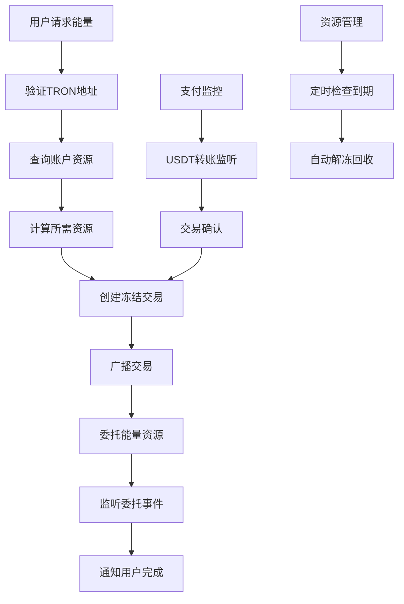

# ⚡ TRON 网络 API 详细文档

> 基于 TRON 官方 API 文档和 TRON 能量租赁项目实际需求整理的完整 API 指南

## 📋 文档目录

### 🏗️ 核心架构
- [项目架构概览](#项目架构概览)
- [API 基础配置](#api-基础配置)
- [网络环境配置](#网络环境配置)

### ⚡ 能量管理（核心功能）
- [1. 账户资源管理 API](./01-account-resources-api.md) - 能量委托、冻结解冻、资源管理
- [2. 账户信息 API](./02-accounts-api.md) - 账户查询、余额管理
- [3. 地址工具 API](./03-address-utilities-api.md) - 地址验证、格式转换

### 🔗 交易处理
- [4. 交易管理 API](./04-transactions-api.md) - 交易创建、广播、查询
- [5. 智能合约 API](./05-smart-contracts-api.md) - USDT/TRC20 合约交互

### 🌐 网络服务
- [6. 网络查询 API](./06-network-query-api.md) - 区块查询、网络状态、价格信息
- [7. TRC 代币 API](./07-trc-tokens-api.md) - TRC10/TRC20 代币操作
- [8. 事件监听 API](./08-events-monitoring-api.md) - 交易事件、支付监控

### 🔐 认证和广播系统
- [9. 密钥认证与交易广播 API](./11-authentication-broadcast-api.md) - 私钥管理、交易签名、交易广播

### 🛠️ 工具和最佳实践
- [10. API 安全指南](./09-security-best-practices.md) - 安全配置、密钥管理、防护措施
- [11. 项目实战示例](./10-project-examples.md) - 完整业务流程、代码示例

## 🎯 项目架构概览

### TRON 能量租赁核心流程



### 主要 API 模块

| 模块 | 主要功能 | 对应官方 API |
|------|----------|--------------|
| **账户资源** | 能量委托、冻结管理 | [Account Resources](https://developers.tron.network/reference/background) |
| **账户管理** | 余额查询、账户信息 | [Accounts](https://developers.tron.network/reference/background) |
| **交易处理** | 交易创建、状态查询 | [Transactions](https://developers.tron.network/reference/background) |
| **合约交互** | USDT转账、代币操作 | [Smart Contracts](https://developers.tron.network/reference/background) |
| **网络查询** | 价格查询、区块信息 | [Query The Network](https://developers.tron.network/reference/background) |
| **事件监听** | 支付监控、状态变更 | [Events](https://developers.tron.network/reference/background) |

## 🔧 API 基础配置

### 网络环境配置

```typescript
// TRON 网络配置
export const TRON_NETWORKS = {
  mainnet: {
    name: 'Mainnet',
    fullNode: 'https://api.trongrid.io',
    solidityNode: 'https://api.trongrid.io',
    eventServer: 'https://api.trongrid.io',
    chainId: 'mainnet'
  },
  shasta: {
    name: 'Shasta Testnet',
    fullNode: 'https://api.shasta.trongrid.io',
    solidityNode: 'https://api.shasta.trongrid.io',
    eventServer: 'https://api.shasta.trongrid.io',
    chainId: 'shasta'
  },
  nile: {
    name: 'Nile Testnet',
    fullNode: 'https://nile.trongrid.io',
    solidityNode: 'https://nile.trongrid.io',
    eventServer: 'https://nile.trongrid.io',
    chainId: 'nile'
  }
};
```

### TronWeb 初始化

```typescript
import TronWeb from 'tronweb';

// 初始化 TronWeb 实例
const tronWeb = new TronWeb({
  fullHost: TRON_NETWORKS.mainnet.fullNode,
  headers: {
    "TRON-PRO-API-KEY": process.env.TRON_API_KEY
  },
  privateKey: process.env.TRON_PRIVATE_KEY
});

// 验证连接
async function initializeTronWeb(): Promise<void> {
  try {
    const nodeInfo = await tronWeb.trx.getNodeInfo();
    console.log('✅ TRON network connected:', nodeInfo.configNodeInfo?.codeVersion);
  } catch (error) {
    console.error('❌ TRON connection failed:', error);
    throw error;
  }
}
```

## 🔐 API 安全配置

### API Key 管理

根据 [TRON 官方文档](https://developers.tron.network/reference/background)，所有 API 请求都需要携带 API Key：

```bash
# 环境变量配置
TRON_API_KEY=your_trongrid_api_key_here
TRON_PRIVATE_KEY=your_private_key_here
TRON_PAYMENT_ADDRESS=TYour_Payment_Address_Here
```

### 安全最佳实践

```typescript
// ✅ 正确的密钥管理
const apiKey = process.env.TRON_API_KEY;
const privateKey = process.env.TRON_PRIVATE_KEY;

if (!apiKey || !privateKey) {
  throw new Error('TRON API credentials are required');
}

// ❌ 错误的做法 - 不要硬编码密钥
const badApiKey = "12345678-abcd-efgh-ijkl-123456789012";
```

## 📊 项目中使用的核心 TRON API

### 🔥 高频使用 API

| API 方法 | 用途 | 调用频率 | 文档链接 |
|----------|------|----------|----------|
| `initializeTronWeb` | 初始化TronWeb并设置私钥 | 启动时 | [认证广播 API](./11-authentication-broadcast-api.md) |
| `GetAccountResource` | 查询账户能量/带宽 | 很高 | [Account Resources API](./01-account-resources-api.md) |
| `DelegateResource` | 委托能量给用户 | 高 | [Account Resources API](./01-account-resources-api.md) |
| `trx.sign` | 交易数字签名 | 高 | [认证广播 API](./11-authentication-broadcast-api.md) |
| `sendRawTransaction` | 广播已签名交易 | 高 | [认证广播 API](./11-authentication-broadcast-api.md) |
| `GetAccount` | 查询账户基本信息 | 高 | [Accounts API](./02-accounts-api.md) |
| `ValidateAddress` | 验证TRON地址格式 | 高 | [Address Utilities API](./03-address-utilities-api.md) |
| `TriggerSmartContract` | USDT转账操作 | 中 | [Smart Contracts API](./05-smart-contracts-api.md) |
| `GetEnergyPrices` | 获取当前能量价格 | 低 | [Network Query API](./06-network-query-api.md) |

### 💰 支付相关 API

| API 方法 | 用途 | 实现状态 |
|----------|------|----------|
| `GetTransactionById` | 查询交易详情 | ✅ 已实现 |
| `GetTransactionInfoById` | 查询交易执行信息 | ✅ 已实现 |
| `TriggerConstantContract` | 查询USDT余额 | ✅ 已实现 |
| `GetEvents` | 监听USDT转账事件 | ✅ 已实现 |

### ⚡ 能量管理 API

| API 方法 | 用途 | 实现状态 |
|----------|------|----------|
| `FreezeBalanceV2` | 冻结TRX获取能量 | ✅ 已实现 |
| `UnfreezeBalanceV2` | 解冻TRX回收能量 | ✅ 已实现 |
| `DelegateResource` | 委托能量给目标地址 | ✅ 已实现 |
| `UnDelegateResource` | 取消能量委托 | ✅ 已实现 |
| `GetDelegatedResourceV2` | 查询委托状态 | ✅ 已实现 |

### 🔐 认证和广播 API

| API 方法 | 用途 | 实现状态 |
|----------|------|----------|
| `initializeTronWeb` | 私钥认证和TronWeb初始化 | ✅ 已实现 |
| `validatePrivateKey` | 私钥格式和安全性验证 | ✅ 已实现 |
| `sign` | 使用私钥对交易进行数字签名 | ✅ 已实现 |
| `sendRawTransaction` | 广播已签名交易到TRON网络 | ✅ 已实现 |
| `waitForConfirmation` | 等待交易确认并监控状态 | ✅ 已实现 |

## 🚀 快速开始

### 0. 初始化TronWeb和认证

```typescript
// 初始化TronWeb和私钥认证
const tronConfig = {
  fullHost: 'https://api.trongrid.io',
  privateKey: process.env.TRON_PRIVATE_KEY,
  headers: {
    "TRON-PRO-API-KEY": process.env.TRON_API_KEY
  }
};

const tronWeb = new TronWeb(tronConfig);
console.log('✅ TronWeb初始化完成，账户地址:', tronWeb.defaultAddress.base58);
```

### 1. 账户资源查询

```typescript
// 查询账户能量状态
async function getAccountResources(address: string) {
  const resources = await tronWeb.trx.getAccountResources(address);
  
  return {
    energy: resources.EnergyLimit || 0,
    energyUsed: resources.EnergyUsed || 0,
    bandwidth: resources.NetLimit || 0,
    bandwidthUsed: resources.NetUsed || 0
  };
}
```

### 2. 能量委托操作（完整的签名+广播流程）

```typescript
// 委托能量给指定地址 - 完整流程
async function delegateEnergy(
  recipientAddress: string, 
  energyAmount: number,
  duration: number = 3600 * 24 // 24小时
) {
  try {
    console.log(`⚡ 开始委托 ${energyAmount} 能量给 ${recipientAddress}`);

    // 1. 创建委托交易
    const transaction = await tronWeb.transactionBuilder.delegateResource(
      energyAmount,
      recipientAddress,
      'ENERGY',
      tronWeb.defaultAddress.base58,
      false, // 不锁定
      duration
    );
    
    // 2. 使用私钥签名交易
    const signedTx = await tronWeb.trx.sign(transaction);
    console.log('✍️ 交易已签名:', signedTx.txID);
    
    // 3. 广播交易到TRON网络
    const result = await tronWeb.trx.sendRawTransaction(signedTx);
    console.log('📡 交易已广播:', result.txid);
    
    // 4. 等待交易确认
    if (result.result) {
      console.log('✅ 能量委托成功!');
      return { success: true, txid: result.txid };
    } else {
      console.error('❌ 交易广播失败:', result.message);
      return { success: false, error: result.message };
    }
  } catch (error) {
    console.error('💥 能量委托失败:', error);
    return { success: false, error: error.message };
  }
}
```

### 3. USDT 余额查询

```typescript
// 查询 USDT-TRC20 余额
const USDT_CONTRACT = 'TR7NHqjeKQxGTCi8q8ZY4pL8otSzgjLj6t';

async function getUSDTBalance(address: string): Promise<number> {
  const contract = await tronWeb.contract().at(USDT_CONTRACT);
  const balance = await contract.balanceOf(address).call();
  return balance.toNumber() / 1000000; // USDT 有 6 位小数
}
```

## 📈 API 限制和配额

### TronGrid API 限制

根据 [TRON 官方文档](https://developers.tron.network/reference/background)：

| 限制类型 | 免费配额 | 付费配额 | 说明 |
|----------|----------|----------|------|
| **请求频率** | 100 次/秒 | 定制 | 需要 API Key |
| **每日请求** | 100,000 次 | 定制 | 重置时间 UTC 0:00 |
| **并发连接** | 5 个 | 定制 | WebSocket 连接数 |
| **历史数据** | 7 天 | 完整历史 | 交易和事件数据 |

### 优化建议

1. **合理使用缓存** - 缓存不经常变化的数据
2. **批量请求** - 合并多个查询减少 API 调用
3. **错误重试** - 实现指数退避重试机制
4. **监控用量** - 跟踪 API 使用情况避免超限

## 🆘 常见问题

### 网络连接问题

1. **API Key 验证失败**
   ```bash
   Error: API key is required
   解决方案: 确保设置正确的 TRON_API_KEY 环境变量
   ```

2. **网络超时**
   ```bash
   Error: connect ETIMEDOUT
   解决方案: 检查网络连接，考虑使用备用节点
   ```

3. **交易失败**
   ```bash
   Error: insufficient bandwidth or energy
   解决方案: 确保账户有足够的带宽和能量资源
   ```

### 调试技巧

```typescript
// 启用 TronWeb 调试模式
if (process.env.NODE_ENV === 'development') {
  tronWeb.setDebugMode(true);
}

// 交易状态检查
async function waitForConfirmation(txId: string, maxWait: number = 60000) {
  const start = Date.now();
  
  while (Date.now() - start < maxWait) {
    try {
      const txInfo = await tronWeb.trx.getTransactionInfo(txId);
      if (txInfo && txInfo.id) {
        return txInfo;
      }
    } catch (error) {
      // 交易可能还未被打包
    }
    
    await new Promise(resolve => setTimeout(resolve, 3000));
  }
  
  throw new Error('Transaction confirmation timeout');
}
```

## 📚 参考资料

### 官方文档
- [TRON Developer Hub](https://developers.tron.network/) - 官方开发者文档
- [TRON API Reference](https://developers.tron.network/reference/background) - 完整 API 参考
- [TronGrid API](https://developers.tron.network/reference/background) - TronGrid 服务文档

### 开发工具
- [TronWeb](https://github.com/tronprotocol/tronweb) - JavaScript SDK
- [TronBox](https://github.com/tronprotocol/tronbox) - 开发框架
- [TronScan](https://tronscan.org/) - 区块链浏览器

### 网络资源
| 网络 | 浏览器 | API 端点 |
|------|--------|----------|
| **主网** | [tronscan.org](https://tronscan.org/) | `https://api.trongrid.io` |
| **Shasta 测试网** | [shasta.tronscan.org](https://shasta.tronscan.org/) | `https://api.shasta.trongrid.io` |
| **Nile 测试网** | [nile.tronscan.org](https://nile.tronscan.org/) | `https://nile.trongrid.io` |

---

> 💡 **提示**: 本文档基于 TRON 官方 API v4.8.0 版本编写，会随着 TRON 网络升级和项目需求变化而持续更新。

> 🔔 **更新通知**: 关注 [TRON Developer Hub](https://developers.tron.network/) 获取最新的 API 更新和网络升级信息。
