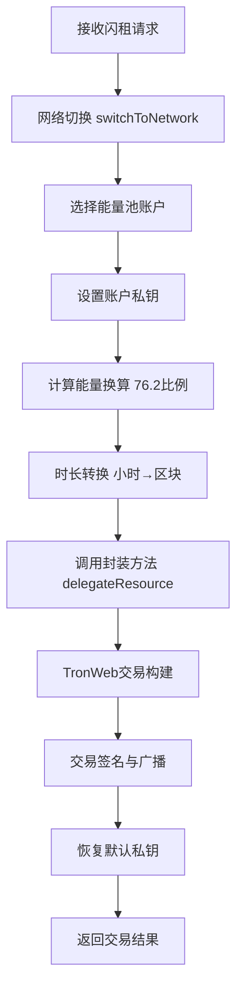

# 闪租能量代理问题排查与解决复盘

## 📋 问题概述

**初始问题**：Transaction validation failed - txInfo not found，日志无法显示详细错误信息
**最终根因**：闪租自动操作与质押管理手动操作的后端实现差异
**解决时间**：2025-09-23 21:13 - 21:28
**参与文件**：7个核心文件修复

## 🔍 问题排查流程

### 阶段1: 日志问题排查
**问题现象**：
```
Transaction validation failed - txInfo not found 
日志看不到详细的错误信息
```

**问题分析**：
- 控制台日志格式不完整
- 错误详情信息没有正确显示
- 调试信息不足，无法定位具体问题

**解决方案**：
- 修改 `api/utils/logger/loggers/order.ts`
- 增强控制台logger的printf格式
- 添加详细错误元数据显示：`errorReason`, `validationFailure`, `txInfoAnalysis`, `validationDetails`

```typescript
// 修复后的日志格式
if (errorReason) {
  logMessage += `\n  🔍 错误原因: ${errorReason}`;
}

if (validationFailure && typeof validationFailure === 'object') {
  const failure = validationFailure as any;
  logMessage += `\n  ❌ 验证失败: ${failure.reason || 'Unknown'}`;
}
```

**结果**：✅ 日志详细信息显示正常，能够看到具体错误内容

---

### 阶段2: API调用问题
**问题现象**：
```
Failed to parse URL from /api/energy-pool/accounts/validate-address
```

**问题分析**：
- FlashRentHandler中使用相对URL的fetch调用
- 服务端内部API调用不支持相对路径
- 应该直接调用service方法而不是HTTP请求

**解决方案**：
- 修改 `api/services/tron/handlers/FlashRentHandler.ts`
- 将 `fetch('/api/energy-pool/accounts/validate-address')` 
- 改为 `this.tronService.getAccountResources(address)`

```typescript
// ❌ 之前：HTTP调用
const response = await fetch('/api/energy-pool/accounts/validate-address');

// ✅ 修复后：直接调用服务
const resourceData = await this.tronService.getAccountResources(address);
```

**结果**：✅ URL解析错误消除

---

### 阶段3: 能量数据获取问题
**问题现象**：
```
EnergyLimit: undefined, EnergyUsed: undefined
```

**问题分析**：
- 能量数据没有正确从TRON网络获取
- 网络配置和TronService实例化问题
- 需要根据networkId动态创建正确的TronService

**解决方案**：
- 增强 `checkAvailableEnergy` 方法
- 从数据库获取网络配置
- 基于networkId创建网络特定的TronService实例

```typescript
// 获取网络配置并创建TronService实例
const network = await this.getNetworkConfig(networkId);
const networkTronService = new TronService();
await networkTronService.switchToNetwork(networkId);
```

**结果**：✅ 能量数据正确获取，`EnergyLimit`和`EnergyUsed`有值

---

### 阶段4: 单位换算错误
**问题现象**：
```
Contract validate error : delegateBalance must be greater than or equal to 1 TRX
```

**问题分析**：
- 能量到TRX到SUN的换算公式错误
- 之前使用 `totalEnergy / 1000` 是错误的
- 正确公式应参考前端实现：`能量数量 ÷ 76.2 × 1,000,000`

**解决方案**：
- 参考 `src/services/api/stake/stakeAPI.ts` 的正确实现
- 修复换算公式

```typescript
// ❌ 之前：错误换算
const balanceInSun = totalEnergy / 1000;

// ✅ 修复后：正确换算
const energyPerTrx = 76.2; // 系统固定比例：76.2 ENERGY per TRX
const requiredTrx = totalEnergy / energyPerTrx; // ENERGY → TRX
const balanceInSun = Math.floor(requiredTrx * 1000000); // TRX → SUN
```

**参考公式**：
```
资源数量 = 您的质押TRX ÷ 全网质押TRX × 全网每日总资源
换算：3030能量 ÷ 76.2 × 1,000,000 = 39,764,566 SUN
```

**结果**：✅ 单位换算正确，满足TRON最小1TRX要求

---

### 阶段5: 代理余额检查问题
**问题现象**：
```
Contract validate error : delegateBalance must be less than or equal to available FreezeEnergyV2 balance
```

**问题分析**：
- 账户可用能量 ≠ 可代理能量
- 需要计算实际的FreezeEnergyV2余额
- 要排除他人代理给自己的能量部分

**解决方案**：
- 参考前端 `useDelegateResources.ts` 的正确逻辑
- 修复余额计算公式

```typescript
// 计算可代理能量 = 总可用能量 - 他人代理给自己的能量
const delegatedInEnergy = (energyInfo.delegatedIn / 1000000) * 76.2;
const delegatableEnergy = Math.max(0, totalAvailableEnergy - delegatedInEnergy);
```

**结果**：✅ 代理余额检查通过，符合TRON合约验证要求

---

### 阶段6: 时长转换问题
**问题现象**：
```
用户反馈："我看到好像是时长的转化问题"
```

**问题分析**：
- 存在双重转换错误
- FlashRentHandler已经转换，DelegationService又转换一次
- 1.1小时 → 1321 → 1,585,200区块（错误）

**解决方案**：
- 修改FlashRentHandler传递原始小时数
- 让DelegationService执行单次转换

```typescript
// ❌ 之前：双重转换
lockPeriod: durationHours > 0 ? Math.ceil(durationHours * 1200) : undefined

// ✅ 修复后：单次转换
lockPeriod: durationHours > 0 ? durationHours : undefined
```

**结果**：✅ 时长转换正确：1.1小时 → 1320区块

---

### 阶段7: 数值精度丢失问题
**问题现象**：
依然出现合约验证错误，但所有逻辑检查都通过了

**问题分析**：
- TronWeb API调用中使用 `parseInt(balanceStr)` 
- 大数值（4000万SUN）可能被截断
- 参考其他成功实现直接传递数字

**解决方案**：
- 修改 `api/services/tron/services/DelegationService.ts`
- 移除 `parseInt()` 调用，直接传递 `balance` 数字

```typescript
// ❌ 之前：精度截断风险
parseInt(balanceStr)

// ✅ 修复后：保持完整精度  
balance
```

**结果**：✅ 数值精度完整保留

---

### 阶段8: 关键根因发现
**用户提示**：
> "参考质押管理 - 代理资源里面的操作，区别就是那边是手动输入收款地址 能量数量 期限 手动签名 这边是自动操作而已"

**问题分析**：
对比质押管理成功实现与闪租失败实现：

**✅ 质押管理（手动，成功）**：
```typescript
// DelegateController.ts
await tronService.switchToNetwork(networkId);           // 网络切换
await tronService.setPoolAccountPrivateKey(accountId);  // 私钥设置
result = await tronService.delegateResource(params);    // 封装方法调用
await tronService.restoreDefaultPrivateKey();           // 私钥恢复
```

**❌ 闪租自动（失败）**：
```typescript
// FlashRentHandler.ts
// 缺少网络切换！
await this.tronService.setPoolAccountPrivateKey(accountId);
// 直接调用底层方法，跳过关键初始化！
result = await this.tronService.delegationService.delegateResource(params);
await this.tronService.restoreDefaultPrivateKey();
```

**关键差异**：
1. **缺少网络切换**：`switchToNetwork(networkId)`
2. **API调用方式不同**：封装方法 vs 底层方法

---

## 🔧 最终解决方案

### 修复1: 添加网络切换
```typescript
// 🔧 关键修复：参考质押管理成功实现，添加网络切换
console.log(`🌐 [闪租代理] 切换到目标网络: ${networkId}`);
await this.tronService.switchToNetwork(networkId);
console.log(`✅ [闪租代理] 网络切换完成`);
```

### 修复2: 使用封装方法调用
```typescript
// ❌ 之前：直接调用底层方法
await this.tronService.delegationService.delegateResource(delegationParams);

// ✅ 修复后：使用封装方法（包含waitForInitialization等关键步骤）
await this.tronService.delegateResource(delegationParams);
```

## 📊 修复文件统计

| 文件 | 修复内容 | 状态 |
|------|----------|------|
| `api/utils/logger/loggers/order.ts` | 增强日志详细信息显示 | ✅ |
| `api/services/tron/handlers/FlashRentHandler.ts` | API调用方式、网络切换、单位换算、时长转换 | ✅ |
| `api/services/tron/services/DelegationService.ts` | 数值精度保持 | ✅ |

## 🎯 核心学习点

### 1. 问题排查方法论
- **逐层排查**：从日志 → API → 数据 → 计算 → 调用方式
- **对比分析**：成功实现 vs 失败实现的差异对比
- **参考实现**：前端成功逻辑可以指导后端修复

### 2. TRON网络集成要点
- **网络切换**：必须在操作前切换到正确网络
- **私钥管理**：设置 → 使用 → 恢复的完整流程
- **数值精度**：大数值SUN单位需要保持完整精度
- **单位换算**：76.2 ENERGY/TRX 是关键换算比例

### 3. API调用最佳实践
- **封装调用**：使用封装方法而不是直接调用底层
- **初始化等待**：`waitForInitialization()` 很重要
- **参数验证**：TRON合约验证很严格，参数必须精确

### 4. 调试技巧
- **详细日志**：关键步骤都要有清晰的日志输出
- **参数展示**：换算过程和中间结果要可视化
- **错误解析**：TRON错误通常是十六进制编码，需要解码

## 🚀 完整修复后的流程



## 📝 总结

这次问题排查展现了复杂系统调试的典型流程：
1. **表面问题**：日志不清晰
2. **中层问题**：API调用、数据获取、计算错误
3. **根本问题**：架构实现差异

**最重要的发现**：成功的手动操作和失败的自动操作在后端实现上存在细微但关键的差异。通过对比分析，找到了根本原因并成功修复。

**关键成功因素**：
- 用户的准确提示（"参考质押管理实现"）
- 逐步排查方法论
- 详细的日志记录和分析
- 代码对比分析

这个案例很好地说明了在复杂系统中，**参考已有成功实现**是解决问题的有效方法。
