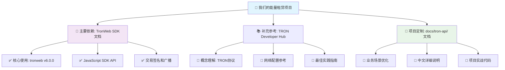
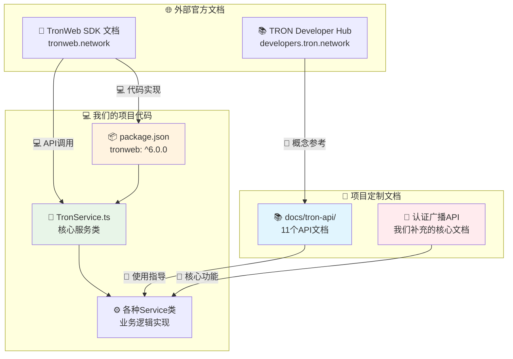
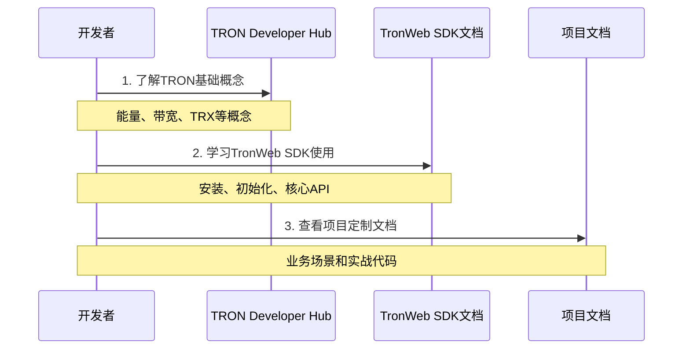
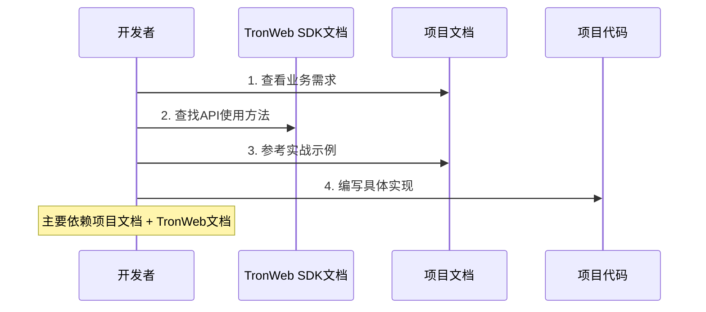
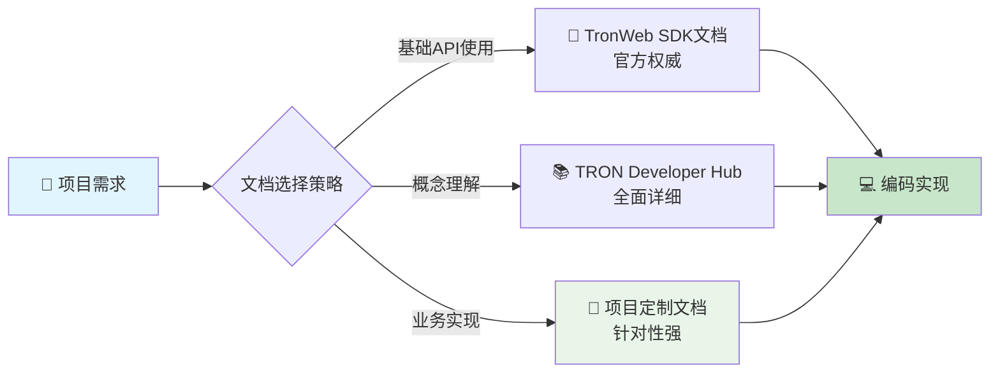
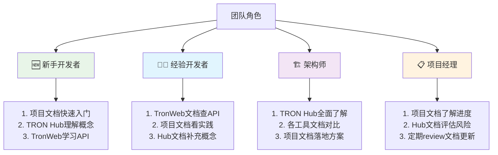
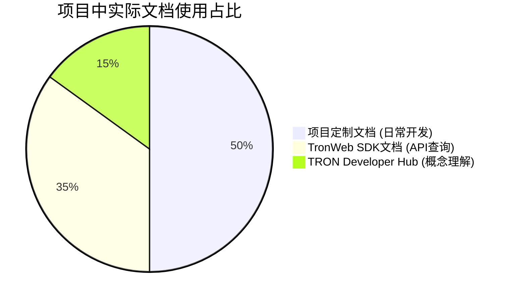

# 🎯 项目 TRON 文档使用关系可视化指南

> 清晰展示我们的能量租赁项目中实际使用的 TRON 文档关系和依赖

## 🔍 **我们项目实际使用什么？**

### 📊 **项目文档使用优先级**



## 📋 **详细使用分析**

### 1. 🎯 **主要依赖: TronWeb SDK 文档**

**使用比重**: 🟢🟢🟢🟢🟢 **90%**

```typescript
// 我们项目中的实际使用
import TronWeb from 'tronweb';  // ← 来自 TronWeb SDK

const tronWeb = new TronWeb({
  fullHost: 'https://api.trongrid.io',
  privateKey: process.env.TRON_PRIVATE_KEY
});
```

**项目中的具体使用场景**:
- ✅ **TronWeb 初始化** - 设置网络和私钥
- ✅ **账户资源查询** - `tronWeb.trx.getAccountResources()`
- ✅ **交易签名** - `tronWeb.trx.sign()`
- ✅ **交易广播** - `tronWeb.trx.sendRawTransaction()`
- ✅ **能量委托** - `tronWeb.transactionBuilder.delegateResource()`

### 2. 📚 **补充参考: TRON Developer Hub**

**使用比重**: 🟡🟡⚪⚪⚪ **30%**

**主要参考内容**:
- 📖 **TRON网络概念** - 理解能量、带宽等概念
- 📖 **HTTP API参考** - 了解底层API调用
- 📖 **安全最佳实践** - 私钥管理等安全配置

### 3. 🔧 **项目定制: 我们的文档**

**使用比重**: 🟢🟢🟢🟢🟢 **100%** (项目内部)

**定制化内容**:
- 🎯 **业务场景优化** - 专门针对能量租赁业务
- 🎯 **中文详细说明** - 便于团队理解
- 🎯 **实战代码示例** - 直接可用的项目代码

## 🏗️ **项目架构中的文档关系**



## 🎯 **实际开发流程中的文档使用**

### 阶段1: 🚀 **项目启动阶段**



### 阶段2: 💻 **日常开发阶段**



## 📊 **文档依赖优先级矩阵**

| 开发场景 | TronWeb SDK文档 | TRON Developer Hub | 项目文档 | 说明 |
|----------|----------------|-------------------|----------|------|
| **🔧 API调用** | 🟢🟢🟢🟢🟢 | 🟡⚪⚪⚪⚪ | 🟢🟢🟢🟢⚪ | 主要看TronWeb，项目文档提供示例 |
| **🎯 业务实现** | 🟢🟢🟢⚪⚪ | 🟡⚪⚪⚪⚪ | 🟢🟢🟢🟢🟢 | 主要看项目文档的业务场景 |
| **🔑 签名广播** | 🟢🟢🟢🟢⚪ | 🟡🟡⚪⚪⚪ | 🟢🟢🟢🟢🟢 | 项目文档补充了官方缺失部分 |
| **📖 概念理解** | 🟢🟢⚪⚪⚪ | 🟢🟢🟢🟢🟢 | 🟢🟢🟢⚪⚪ | TRON Hub提供最全面概念 |
| **🐛 问题排查** | 🟢🟢🟢🟢⚪ | 🟢🟢🟢⚪⚪ | 🟢🟢🟢🟢🟢 | 项目文档有针对性解决方案 |
| **🔒 安全配置** | 🟢🟢🟢⚪⚪ | 🟢🟢🟢🟢⚪ | 🟢🟢🟢🟢🟢 | 项目文档有企业级安全实践 |

## 🎯 **我们项目的文档策略**

### ✅ **采用的策略: 混合文档模式**



### 🔄 **文档使用工作流**

1. **🆕 新功能开发**:
   ```
   项目需求分析 → 项目文档查业务场景 → TronWeb文档查API → 编码实现
   ```

2. **🐛 问题排查**:
   ```
   错误分析 → 项目文档查常见问题 → TronWeb文档查API细节 → TRON Hub查概念
   ```

3. **🔒 安全优化**:
   ```
   安全需求 → 项目文档查企业实践 → TRON Hub查官方建议 → 代码实施
   ```

## 📈 **文档价值对比**

### 📖 **TronWeb SDK 文档**
**优势**:
- ✅ **官方权威**: API接口最准确、最新
- ✅ **代码示例**: 直接可用的代码片段
- ✅ **版本同步**: 与SDK版本完全同步

**局限**:
- ❌ **英文文档**: 需要一定英语基础
- ❌ **通用性**: 没有特定业务场景优化
- ❌ **深度不足**: 缺少企业级实践指导

### 📚 **TRON Developer Hub**
**优势**:
- ✅ **概念全面**: TRON生态系统完整视图
- ✅ **架构理解**: 底层原理和设计思想
- ✅ **多工具介绍**: 不局限于单一SDK

**局限**:
- ❌ **泛泛而谈**: 缺少深入的实施细节
- ❌ **更新滞后**: 可能不是最新的技术细节
- ❌ **英文为主**: 中文资源相对较少

### 🔧 **我们的项目文档**
**优势**:
- ✅ **业务针对性**: 专门为能量租赁业务优化
- ✅ **中文详解**: 团队成员理解无障碍
- ✅ **实战代码**: 直接从项目中提取的可用代码
- ✅ **问题导向**: 解决实际开发中遇到的具体问题

**局限**:
- ❌ **覆盖面有限**: 只涵盖项目相关功能
- ❌ **更新依赖**: 需要随项目发展持续更新

## 🎯 **推荐的文档使用策略**

### 👥 **针对不同角色的建议**



### 📅 **日常开发建议**

| 时间段 | 主要使用文档 | 使用目的 |
|--------|-------------|----------|
| **早晨规划** | 🔧 项目文档 | 了解当日开发任务和业务需求 |
| **编码开发** | 📖 TronWeb SDK | 查找具体API使用方法 |
| **问题排查** | 🔧 项目文档 + 📖 TronWeb | 结合业务场景和技术细节 |
| **概念疑惑** | 📚 TRON Hub | 深入理解TRON网络原理 |
| **代码审查** | 🔧 项目文档 | 对照最佳实践和安全规范 |

## ✅ **总结: 我们项目的文档生态**

### 🎯 **核心结论**



**我们主要使用**:
1. **🥇 项目定制文档** (50%) - 日常业务开发的主要依据
2. **🥈 TronWeb SDK文档** (35%) - API使用的权威参考
3. **🥉 TRON Developer Hub** (15%) - 概念理解的补充资源

### 🚀 **建议行动**

1. **📖 保持更新**: 定期同步项目文档与最新的TronWeb版本
2. **🔄 优化结构**: 根据实际使用频率调整项目文档结构
3. **👥 团队培训**: 确保团队成员了解文档使用策略
4. **📊 效果评估**: 定期评估文档使用效果并持续优化

---

> 💡 **关键提示**: 我们的项目采用了**混合文档策略**，以**项目定制文档为主导**，**TronWeb SDK文档为技术支撑**，**TRON Developer Hub为概念补充**的三层文档体系，确保开发效率和代码质量！
