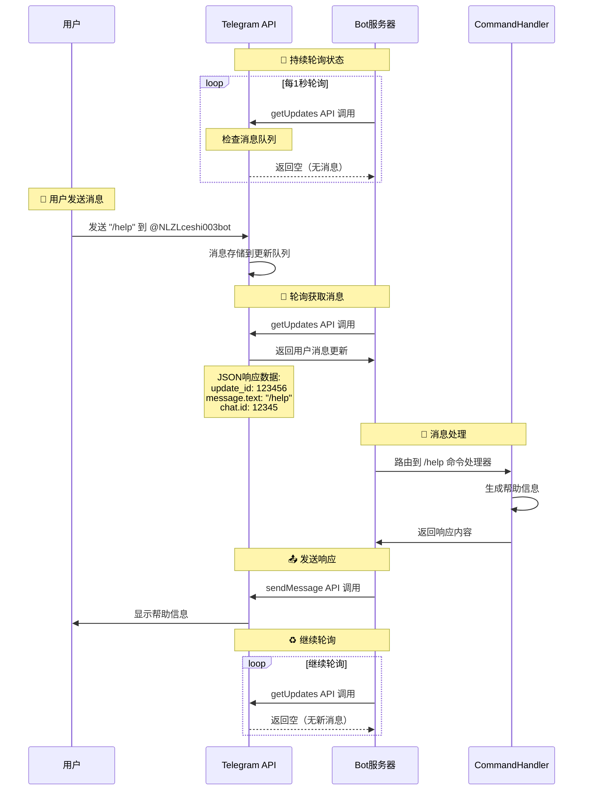
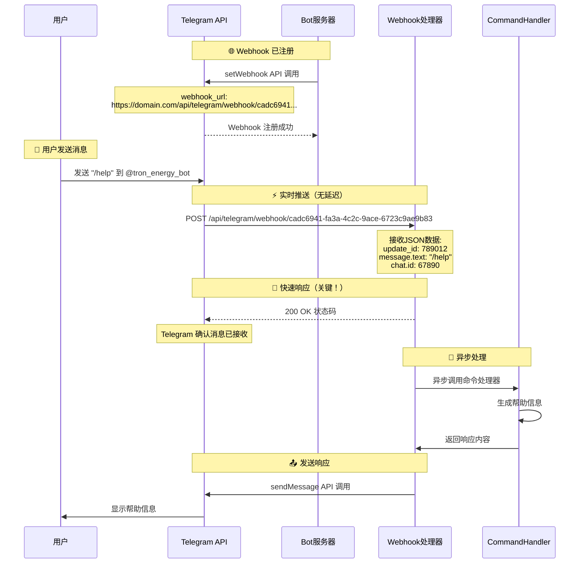

# 测试修复后的 Mermaid 流程图

## 🔄 Polling 模式流程图测试



## 🔗 Webhook 模式流程图测试



## 修复说明

### 🔧 问题原因
原流程图中包含的 JSON 对象格式：
```json
{
  "update_id": 123456,
  "message": {
    "chat": {"id": 12345},
    "text": "/help"
  }
}
```

这种格式在 Mermaid sequenceDiagram 中会导致语法错误。

### ✅ 解决方案
将 JSON 数据转换为 Mermaid 兼容的格式：
```
Note over T: JSON响应数据:<br/>update_id: 123456<br/>message.text: "/help"<br/>chat.id: 12345
```

使用 `<br/>` 标签进行换行，避免复杂的对象结构。
